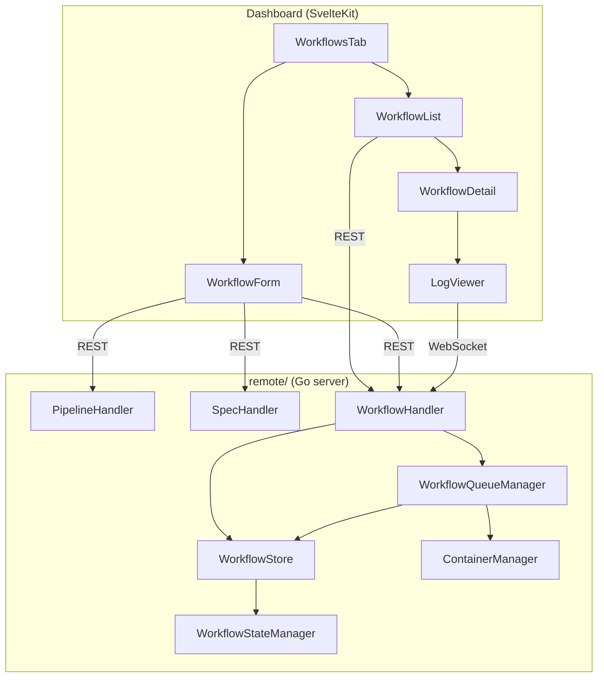
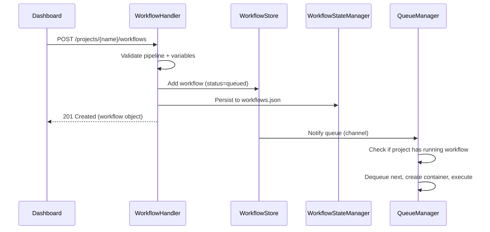
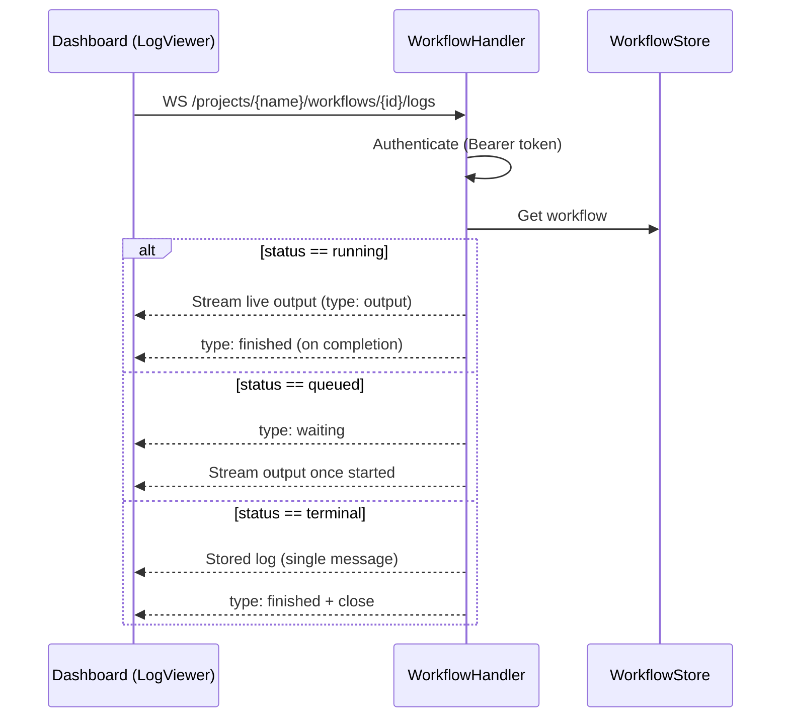

# Design Document: Dashboard Workflow Runner

## Overview

This feature adds a "Workflows" tab to the trayline dashboard, allowing users to schedule, manage, and monitor trayline pipeline executions from the web interface. The implementation follows existing patterns established by the task/session infrastructure in the Go backend and the SvelteKit frontend.

**Key design decisions:**

1. **Separate persistence file** (`workflows.json`) — Workflows have different lifecycle semantics than tasks/sessions and benefit from independent persistence, avoiding risk to existing state recovery.
2. **Per-project sequential queue** — Pipelines modify project files; concurrent execution within the same project would cause conflicts. Cross-project parallelism is supported.
3. **WebSocket log streaming** — Reuses the gorilla/websocket dependency and auth pattern from the existing chat WebSocket, providing real-time output without polling.
4. **Pipeline discovery from filesystem** — Reads YAML files at request time (no caching), keeping the implementation simple and always reflecting the current state of the mounted pipelines directory.
5. **5-hour default timeout** — Workflows run complex multi-step pipelines that can include multiple AI agent interactions; a 5-hour default (`WORKFLOW_TIMEOUT=5h`) accommodates long-running pipelines while still preventing runaway containers.

## Architecture



### Request Flow — Workflow Scheduling



### Request Flow — Log Streaming



## Components and Interfaces

### Backend Components

#### 1. `api/pipeline_handler.go` — Pipeline Discovery

Handles pipeline listing and detail endpoints.

```go
type PipelineHandler struct {
    config *core.Config
    logger *core.Logger
}

// Endpoints:
// GET /projects/{name}/pipelines                   → ListPipelines
// GET /projects/{name}/pipelines/{type}/{pipeline} → GetPipelineDetail
```

- Reads YAML files from `config.PipelinesDir/{type}/` subdirectories
- Parses only the `variables` section using `gopkg.in/yaml.v3`
- Validates pipeline type is one of: tasks, processes, workflows
- Returns pipeline name (filename without `.yaml`), type, and display_name (hyphens → spaces)

#### 2. `api/spec_handler.go` — Spec Discovery

Handles spec listing for autocomplete in the workflow form.

```go
type SpecHandler struct {
    config *core.Config
    logger *core.Logger
}

// Endpoint:
// GET /projects/{name}/specs → ListSpecs
```

- Scans `PROJECTS_DIR/{name}/.kiro/specs/` directories
- Filters to specs where `tasks.md` contains `- [ ]` (unchecked tasks)
- Returns sorted by directory modification time descending

#### 3. `api/workflow_handler.go` — Workflow CRUD + Log Streaming

Handles workflow creation, listing, detail, edit, cancel, and WebSocket log streaming.

```go
type WorkflowHandler struct {
    store      *store.WorkflowStore
    cm         *docker.ContainerManager
    config     *core.Config
    logger     *core.Logger
    stateMgr   *store.WorkflowStateManager
    queues     *WorkflowQueueManager
}

// Endpoints:
// POST   /projects/{name}/workflows           → Schedule
// GET    /projects/{name}/workflows           → List
// GET    /projects/{name}/workflows/{id}      → Detail
// PUT    /projects/{name}/workflows/{id}      → Edit
// DELETE /projects/{name}/workflows/{id}      → Cancel
// GET    /projects/{name}/workflows/{id}/logs → WebSocket log stream
```

#### 4. `store/workflow.go` — Workflow Store

Thread-safe in-memory store for workflow data, following the same pattern as `store/task.go`.

```go
type WorkflowStatus string

const (
    WorkflowQueued    WorkflowStatus = "queued"
    WorkflowRunning   WorkflowStatus = "running"
    WorkflowCompleted WorkflowStatus = "completed"
    WorkflowFailed    WorkflowStatus = "failed"
    WorkflowCancelled WorkflowStatus = "cancelled"
)

type Workflow struct {
    ID          string            `json:"id"`
    Project     string            `json:"project"`
    Pipeline    string            `json:"pipeline"`
    Variables   map[string]string `json:"variables"`
    Status      WorkflowStatus    `json:"status"`
    CreatedAt   time.Time         `json:"created_at"`
    StartedAt   *time.Time        `json:"started_at,omitempty"`
    CompletedAt *time.Time        `json:"completed_at,omitempty"`
    Error       string            `json:"error,omitempty"`
    ExitCode    *int              `json:"exit_code,omitempty"`
    ContainerID string            `json:"-"`
    CancelFunc  context.CancelFunc `json:"-"`
    LogBuffer   *RingBuffer       `json:"-"`
    LogSubs     []chan string     `json:"-"` // subscribers for live log streaming
}
```

The `WorkflowStore` provides:

```go
type WorkflowStore struct {
    mu        sync.RWMutex
    workflows map[string]*Workflow // keyed by ID
    byProject map[string][]string // project → ordered workflow IDs (creation order)
}

func (s *WorkflowStore) Add(w *Workflow)
func (s *WorkflowStore) Get(id string) *Workflow
func (s *WorkflowStore) Update(id string, fn func(*Workflow)) bool
func (s *WorkflowStore) ListByProject(project string) []*Workflow  // most recent 20, desc
func (s *WorkflowStore) NextQueued(project string) *Workflow       // oldest queued for project
func (s *WorkflowStore) HasRunning(project string) bool
func (s *WorkflowStore) All() []*Workflow                          // for persistence
func (s *WorkflowStore) Evict(project string)                      // remove oldest terminal beyond 20
```

#### 5. `store/workflow_state.go` — Persistence

Handles JSON file persistence following the atomic write pattern from `store/state.go`.

```go
type WorkflowStateManager struct {
    stateDir      string
    workflowStore *WorkflowStore
    logger        *core.Logger
}

func (sm *WorkflowStateManager) Save() error   // atomic write: temp + rename
func (sm *WorkflowStateManager) Load() error   // read on startup
func (sm *WorkflowStateManager) Recover() error // handle running→failed, resume queued
```

Persistence file: `STATE_DIR/workflows.json`

#### 6. `WorkflowQueueManager` — Per-Project Queue Processor

Manages per-project sequential execution using goroutines and channels.

```go
type WorkflowQueueManager struct {
    mu       sync.Mutex
    active   map[string]bool       // project → has active processor goroutine
    notify   map[string]chan struct{} // project → signal channel
    store    *store.WorkflowStore
    cm       *docker.ContainerManager
    config   *core.Config
    logger   *core.Logger
    stateMgr *store.WorkflowStateManager
}

func (q *WorkflowQueueManager) Enqueue(project string) // signal the processor
func (q *WorkflowQueueManager) processLoop(project string) // goroutine per project
```

The processor goroutine:
1. Checks `store.HasRunning(project)` — if yes, waits
2. Calls `store.NextQueued(project)` — if nil, exits goroutine (idle cleanup)
3. Creates Docker container, runs `trayline run ...` command
4. Streams stdout/stderr to ring buffer + broadcasts to WebSocket subscribers
5. On completion: updates status, persists state, loops back to step 1

#### 7. `store/ringbuffer.go` — Log Ring Buffer

```go
// RingBuffer captures up to maxSize bytes, discarding oldest when full.
type RingBuffer struct {
    mu        sync.Mutex
    buf       []byte
    maxSize   int
    writePos  int
    wrapped   bool // true if oldest content has been discarded
}

func NewRingBuffer(maxSize int) *RingBuffer
func (rb *RingBuffer) Write(p []byte) (n int, err error)
func (rb *RingBuffer) String() string  // returns contents in order
func (rb *RingBuffer) Wrapped() bool   // true if truncation occurred
```

- Maximum 1MB per workflow (1 * 1024 * 1024 bytes)
- Implements `io.Writer` for direct use with container log streaming
- Thread-safe for concurrent write (from container) and read (from WebSocket handler)

### Frontend Components

#### 1. `src/routes/[project]/workflows/+page.svelte`

Main workflows page with list view and expandable details.

#### 2. `src/lib/components/WorkflowList.svelte`

Displays the workflow queue with status badges, polling every 5 seconds using `setInterval` + `document.hidden` check.

#### 3. `src/lib/components/WorkflowForm.svelte`

Creation/edit form with:
- Pipeline selector dropdown grouped by type (optgroup)
- Variable inputs with default values pre-filled
- Specs autocomplete dropdown for `specs-name` variable
- Toggle switches for `skip-*` variables
- Validation and submission

#### 4. `src/lib/components/WorkflowLogViewer.svelte`

Terminal-styled log viewer with:
- Monospace font, dark background, fixed max height with overflow-y scroll
- WebSocket connection for live output (running workflows)
- Static display for completed/failed workflows (no WebSocket needed)
- Auto-scroll to bottom unless user scrolled up > 50px
- Reconnection logic (one attempt within 10 seconds)
- Truncation notice when buffer wrapped

#### 5. `src/lib/stores/workflow.ts`

Svelte store managing workflow list state and polling lifecycle.

### API Client Extensions (`src/lib/api.ts`)

```typescript
// New types
export interface Pipeline {
    name: string;
    type: 'tasks' | 'processes' | 'workflows';
    display_name: string;
}

export interface PipelinesResponse {
    tasks: Pipeline[];
    processes: Pipeline[];
    workflows: Pipeline[];
}

export interface PipelineDetail {
    name: string;
    type: string;
    variables: Record<string, string>;
}

export interface Spec {
    name: string;
    created_at: string;
}

export interface Workflow {
    id: string;
    pipeline: string;
    variables: Record<string, string>;
    status: 'queued' | 'running' | 'completed' | 'failed' | 'cancelled';
    created_at: string;
    started_at?: string;
    completed_at?: string;
    error?: string;
    exit_code?: number;
    log?: string;
}
```

```typescript
// New API methods added to the api object
getPipelines: (name: string) =>
    request<PipelinesResponse>('GET', `/projects/${enc(name)}/pipelines`),

getPipelineDetail: (name: string, type: string, pipeline: string) =>
    request<PipelineDetail>('GET', `/projects/${enc(name)}/pipelines/${enc(type)}/${enc(pipeline)}`),

getSpecs: (name: string) =>
    request<Spec[]>('GET', `/projects/${enc(name)}/specs`),

getWorkflows: (name: string) =>
    request<Workflow[]>('GET', `/projects/${enc(name)}/workflows`),

getWorkflow: (name: string, id: string) =>
    request<Workflow>('GET', `/projects/${enc(name)}/workflows/${enc(id)}`),

createWorkflow: (name: string, data: { pipeline: string; variables: Record<string, string> }) =>
    request<Workflow>('POST', `/projects/${enc(name)}/workflows`, data),

updateWorkflow: (name: string, id: string, data: { pipeline?: string; variables: Record<string, string> }) =>
    request<Workflow>('PUT', `/projects/${enc(name)}/workflows/${enc(id)}`, data),

cancelWorkflow: (name: string, id: string) =>
    request<Workflow>('DELETE', `/projects/${enc(name)}/workflows/${enc(id)}`),
```

```typescript
// WebSocket URL builder
export function buildWorkflowLogWsUrl(projectName: string, workflowId: string): string {
    const base = (import.meta.env.PUBLIC_API_URL as string).replace(/^http/, 'ws');
    return `${base}/projects/${encodeURIComponent(projectName)}/workflows/${encodeURIComponent(workflowId)}/logs`;
}
```

## Data Models

### Backend — Persisted Workflow (JSON)

```json
{
    "id": "uuid-string",
    "project": "my-project",
    "pipeline": "processes/4-create-code",
    "variables": {
        "specs-name": "010-dashboard-workflow-runner",
        "path": ".",
        "number": "1"
    },
    "status": "completed",
    "created_at": "2025-01-15T10:30:00Z",
    "started_at": "2025-01-15T10:30:05Z",
    "completed_at": "2025-01-15T10:45:30Z",
    "error": "",
    "exit_code": 0,
    "log": "... captured output up to 1MB ..."
}
```

### Backend — Configuration (new env vars)

| Variable | Description | Default |
|----------|-------------|---------|
| `TRAYLINE_HOME_DIR` | Host path to `~/.trayline` directory | `~/.trayline` (expanded at config load) |
| `PIPELINES_DIR` | Host path to pipelines directory | `TRAYLINE_HOME_DIR/pipelines` |
| `WORKFLOW_TIMEOUT` | Max duration for a single workflow execution | `5h` |

These are added to `core.Config` struct:

```go
// New fields in Config
TraylineHomeDir string        // resolved from TRAYLINE_HOME_DIR
PipelinesDir    string        // resolved from PIPELINES_DIR or TraylineHomeDir + "/pipelines"
WorkflowTimeout time.Duration // resolved from WORKFLOW_TIMEOUT, default 5h
```

### Frontend — Workflow WebSocket Messages

**Server → Client:**

```typescript
// Live output chunk
{ type: "output", data: "line of text\n" }

// Workflow finished
{ type: "finished", status: "completed" | "failed", exit_code: number }

// Waiting for workflow to start (queued)
{ type: "waiting" }
```

### Container Configuration for Workflows

Workflows reuse the project-scoped container pattern from `StartProjectChatContainer`, with differences:

| Aspect | Chat Container | Workflow Container |
|--------|---------------|-------------------|
| Image | `trayline-sandbox` | `trayline-sandbox` |
| Network | `trayline-net` | `trayline-net` |
| Project mount | `PROJECTS_DIR/{name}:/workspace` | `PROJECTS_DIR/{name}:/workspace` |
| Extra mount | Agent credentials | `TRAYLINE_HOME_DIR:/home/agent/.trayline:ro` |
| Env vars | `DOCKER_HOST`, `NO_COLOR=1` | `DOCKER_HOST`, `NO_COLOR=1` |
| Interactive | Yes (stdin attached) | No (one-shot, logs captured) |
| Command | Agent CLI (chat mode) | `trayline run {pipeline} --var k=v ...` |
| Timeout | Session timeout (24h) | `WORKFLOW_TIMEOUT` (5h default) |

### Command Construction

The workflow command is built as:

```go
func buildWorkflowCmd(pipeline string, variables map[string]string) []string {
    cmd := []string{"trayline", "run", pipeline}
    for key, value := range variables {
        cmd = append(cmd, "--var", key+"="+value)
    }
    return cmd
}
```

Variable iteration order doesn't matter since `--var` flags are order-independent.

### Validation Rules

**Pipeline reference format:** `{type}/{name}` where:
- `type` ∈ {"tasks", "processes", "workflows"}
- `name` corresponds to a `.yaml` file in `PIPELINES_DIR/{type}/`

**Variable constraints:**
- Keys: match `[a-zA-Z0-9_-]`, max 100 characters
- Values: max 1000 characters
- Max 50 entries per workflow

### Router Integration

New routes added to `api/router.go`:

```go
// Pipeline discovery
mux.HandleFunc("GET /projects/{name}/pipelines", pipelineH.HandleListPipelines)
mux.HandleFunc("GET /projects/{name}/pipelines/{type}/{pipeline}", pipelineH.HandleGetPipelineDetail)

// Spec discovery
mux.HandleFunc("GET /projects/{name}/specs", specH.HandleListSpecs)

// Workflow endpoints
mux.HandleFunc("POST /projects/{name}/workflows", workflowH.HandleSchedule)
mux.HandleFunc("GET /projects/{name}/workflows", workflowH.HandleList)
mux.HandleFunc("GET /projects/{name}/workflows/{id}", workflowH.HandleDetail)
mux.HandleFunc("PUT /projects/{name}/workflows/{id}", workflowH.HandleEdit)
mux.HandleFunc("DELETE /projects/{name}/workflows/{id}", workflowH.HandleCancel)
mux.HandleFunc("GET /projects/{name}/workflows/{id}/logs", workflowH.HandleLogs)
```

### CORS Update

The existing CORS middleware (in `api/cors.go`) must be updated to allow the new HTTP methods used by workflow endpoints:

- **Current allowed methods:** `GET, PUT, OPTIONS`
- **Updated allowed methods:** `GET, POST, PUT, DELETE, OPTIONS`

This is a one-line change in the `Access-Control-Allow-Methods` header value.

## Correctness Properties

*A property is a characteristic or behavior that should hold true across all valid executions of a system — essentially, a formal statement about what the system should do. Properties serve as the bridge between human-readable specifications and machine-verifiable correctness guarantees.*

### Property 1: Pipeline name transformation

*For any* valid YAML filename (containing alphanumeric characters and hyphens, ending in `.yaml`), the pipeline name SHALL equal the filename without the `.yaml` extension, and the display_name SHALL equal the name with all hyphens replaced by spaces.

**Validates: Requirements 1.2**

### Property 2: Workflow input validation

*For any* string used as a variable key, the validation function SHALL accept it if and only if it matches the regex `^[a-zA-Z0-9_-]{1,100}$`; for any string used as a variable value, it SHALL accept it if and only if its length does not exceed 1000 characters; for any variables map, it SHALL accept it if and only if it contains at most 50 entries; for any pipeline type string, it SHALL accept it if and only if it is one of "tasks", "processes", or "workflows".

**Validates: Requirements 1.5, 3.4, 3.5, 3.7, 6.2**

### Property 3: Workflow creation invariants

*For any* valid workflow creation request, the resulting workflow object SHALL have a non-empty UUID as its ID, status equal to "queued", and a created_at timestamp that is not zero-valued and not in the future.

**Validates: Requirements 3.3**

### Property 4: Sequential execution per project

*For any* project and any point in time, the workflow store SHALL contain at most one workflow with status "running" for that project. Multiple projects MAY each have one running workflow simultaneously.

**Validates: Requirements 4.1, 4.2**

### Property 5: Command construction correctness

*For any* valid pipeline reference (format "type/name") and any map of variables with valid keys and values, the constructed command SHALL be `["trayline", "run", pipeline, "--var", "k1=v1", "--var", "k2=v2", ...]` containing exactly one `--var` flag per variable entry, with each flag value being `key=value` concatenation.

**Validates: Requirements 4.4**

### Property 6: Workflow listing is ordered and capped

*For any* project with N workflows (N ≥ 0), the list endpoint SHALL return min(N, 20) workflows sorted by created_at descending (most recent first), and for any two adjacent workflows in the result, the first SHALL have a created_at ≥ the second.

**Validates: Requirements 5.1**

### Property 7: State machine edit/cancel constraints

*For any* workflow in a non-queued status (running, completed, failed, cancelled), an edit request SHALL be rejected with HTTP 409. *For any* workflow in a terminal status (completed, failed, cancelled), a cancel request SHALL be rejected with HTTP 409.

**Validates: Requirements 6.3, 6.7**

### Property 8: Edit preserves queue position

*For any* set of queued workflows for a project, editing a workflow's variables or pipeline SHALL not change its position relative to other queued workflows. The creation order (used for execution priority) SHALL remain identical before and after the edit.

**Validates: Requirements 6.9**

### Property 9: Ring buffer size invariant

*For any* sequence of byte writes to the ring buffer, the buffer's stored content SHALL never exceed the configured maximum size (1 MB). After writing N total bytes where N > maxSize, the buffer SHALL contain exactly the most recent maxSize bytes and report that truncation occurred.

**Validates: Requirements 7.6**

### Property 10: Persistence round-trip

*For any* valid workflow store state (containing workflows with various statuses, variables, timestamps, and log data), serializing to JSON and then deserializing SHALL produce an equivalent set of workflows with all persisted fields preserved (id, project, pipeline, variables, status, created_at, started_at, completed_at, error, exit_code, log).

**Validates: Requirements 8.1, 8.4, 8.8**

## Error Handling

### Backend Error Responses

All error responses follow the existing pattern from `core.ErrorResponse`:

```go
type ErrorResponse struct {
    Error   string `json:"error"`
    Message string `json:"message"`
}
```

| Scenario | HTTP Status | Error Code | Message |
|----------|-------------|------------|---------|
| Invalid pipeline type | 400 | VALIDATION_ERROR | "pipeline type must be one of: tasks, processes, workflows" |
| Invalid variable key | 400 | VALIDATION_ERROR | "variable key contains invalid characters" |
| Variable value too long | 400 | VALIDATION_ERROR | "variable value exceeds 1000 characters" |
| Too many variables | 400 | VALIDATION_ERROR | "variables object exceeds 50 entries" |
| Pipeline not found | 404 | NOT_FOUND | "pipeline {type}/{name} not found" |
| Workflow not found | 404 | NOT_FOUND | "workflow {id} not found" |
| Project not found | 404 | NOT_FOUND | "project {name} not found" |
| Edit non-queued | 409 | CONFLICT | "only queued workflows can be edited" |
| Cancel terminal | 409 | CONFLICT | "workflow is already in a terminal status" |
| Pipelines dir missing | 500 | CONFIGURATION_ERROR | "pipelines directory is missing" |
| Trayline home missing | 500 | CONFIGURATION_ERROR | "trayline home directory is missing" |

### Container Execution Errors

- **Timeout:** Container killed after `WORKFLOW_TIMEOUT`; workflow status set to "failed", error message: "workflow timed out after {duration}"
- **Non-zero exit:** Status set to "failed", stderr captured as error, exit code recorded
- **Container creation failure:** Status set to "failed", Docker error message stored
- **Server restart during execution:** Running workflows marked as "failed" with error "server restarted and container was lost" (same pattern as task recovery)

### WebSocket Error Handling

- **Auth failure:** WebSocket upgrade rejected with HTTP 401 (before upgrade)
- **Workflow not found:** Upgrade rejected with HTTP 404
- **Connection lost during streaming:** Server cleans up subscriber; client shows reconnection notice
- **Multiple subscribers:** Supported — each gets independent broadcast via channel

### Persistence Error Handling

- **Disk write failure:** Logged as error, server continues with in-memory state (no crash)
- **Corrupt JSON on startup:** Renamed to `workflows.json.corrupt`, empty store initialized, startup continues
- **Missing file on startup:** Empty store initialized (normal first-run behavior)

### Frontend Error Handling

- **API fetch failure:** Inline error message with retry button (workflow list, pipeline details)
- **Form submission failure:** Form stays open, input preserved, inline error displayed
- **Edit 409 (no longer queued):** Form closed, error message shown, list refreshed
- **Cancel 409 (already terminal):** Dialog dismissed, error shown, list refreshed
- **WebSocket disconnect:** Reconnection notice in log viewer, one retry within 10 seconds
- **WebSocket reconnect failure:** Persistent disconnection error in log viewer

## Testing Strategy

### Backend Tests (Go)

**Property-based tests** using `testing/quick` or `github.com/leanovate/gopter`:

- Pipeline name/display_name transformation (Property 1)
- Variable and pipeline validation logic (Property 2)
- Workflow creation invariants (Property 3)
- Sequential execution constraint (Property 4)
- Command construction (Property 5)
- Listing order and cap (Property 6)
- State machine constraints (Property 7)
- Queue position preservation (Property 8)
- Ring buffer size invariant (Property 9)
- Persistence serialization round-trip (Property 10)

Each property test runs minimum 100 iterations with randomized inputs.
Tag format: `// Feature: 010-dashboard-workflow-runner, Property N: <description>`

**Unit tests** (example-based):

- Pipeline handler: list pipelines from temp dir, get pipeline detail, 404/400 errors
- Spec handler: filter specs with/without unchecked tasks, sorting, empty cases
- Workflow handler: create/list/detail/edit/cancel request-response cycle
- Workflow store: add, get, update, list, next-queued operations
- State manager: save/load, corrupt file handling, recovery logic
- Queue manager: sequential execution, cross-project parallelism
- Ring buffer: write, wrap, read ordered content

**Integration tests** (with mock Docker client):

- Full workflow lifecycle: schedule → queue → run → complete
- WebSocket log streaming (running, queued, terminal workflows)
- Container configuration verification (mounts, env, network, command)
- Cancellation with SIGTERM/SIGKILL sequence

### Frontend Tests (Vitest + Testing Library)

**Component tests:**

- WorkflowList: renders statuses, polls correctly, handles empty state
- WorkflowForm: pipeline selector grouping, variable inputs, skip toggles, validation
- WorkflowLogViewer: renders log output, auto-scroll behavior
- TabBar: workflows tab present in correct position

**Store tests:**

- Workflow store: state management, polling lifecycle

**API client tests:**

- New methods construct correct URLs and payloads
- WebSocket URL builder produces correct format

### PBT Library Choice

Go backend: `testing/quick` from the standard library for simple properties, `github.com/leanovate/gopter` for more complex generators (structured workflow data, variable maps).

Configuration: minimum 100 iterations per property test (`gopter.DefaultTestParameters().MinSuccessfulTests = 100`).
