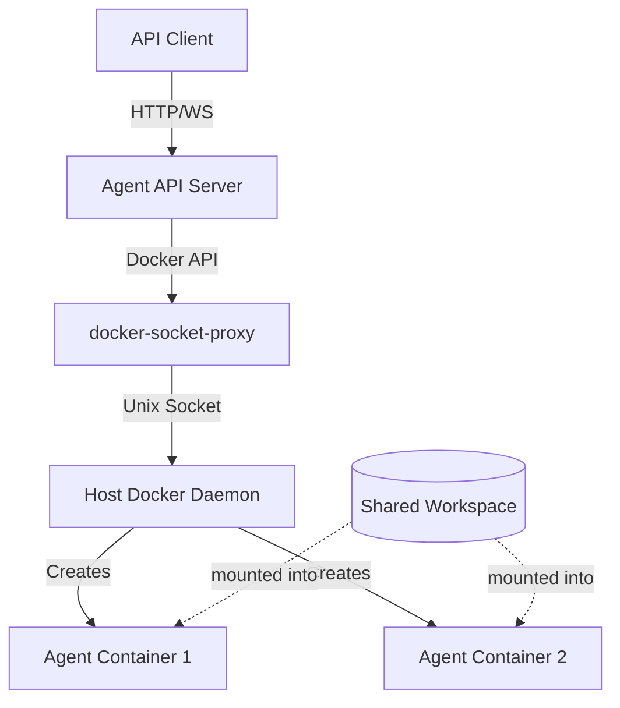
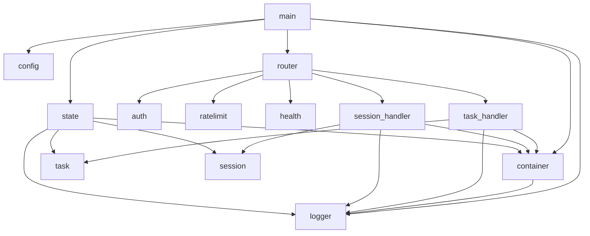

# Design Document: Agent API Server

## Overview

The Agent API Server is a Go HTTP server that exposes a REST and WebSocket API for programmatic interaction with AI agents (Kiro CLI and Claude Code). It replaces the CLI-only interface (`trayline agent`) with a network-accessible service suitable for automation, external tooling, and multi-client access.

The server runs as a Docker container alongside the existing `trayline-proxy` (docker-socket-proxy) and manages sibling agent containers via the Docker API. Each agent invocation runs inside an ephemeral `trayline-sandbox` container — the same image used by the CLI — ensuring identical execution environments.

Two operational modes:
- **One-Shot (REST)** — Submit a prompt, get a result. Stateless, ephemeral container, long-poll or poll for results.
- **Chat (WebSocket)** — Open a session, exchange multiple messages with streaming output. Stateful, persistent container per session.

Both modes share a global workspace directory mounted into every agent container.

## Architecture

### System Context



### Container Topology

All containers live on the `trayline-net` Docker network:

| Container | Image | Role |
|-----------|-------|------|
| `trayline-server` | Custom (built from `server/Dockerfile`) | API server, manages agent lifecycle |
| `trayline-proxy` | `tecnativa/docker-socket-proxy` | Filters Docker API access |
| Agent containers | `trayline-sandbox` | Ephemeral agent execution environments |

### Key Architectural Decisions

1. **Sibling containers via Docker socket** — The server container doesn't run agents inside itself. It creates sibling containers via the Docker API through the proxy. This keeps the server lightweight and allows independent resource management per agent.

2. **Host path for volume mounts** — Since `docker create` runs on the host daemon, volume mounts must reference host paths. The server reads `WORKSPACE_HOST_DIR` for the path the host sees, while `WORKSPACE_DIR` is the path inside the server container.

3. **In-memory state** — Task and session stores are in-memory maps. No database. Simplicity over durability — tasks are short-lived and sessions are tied to container lifecycle.

4. **Concurrency via goroutines + semaphore** — A buffered channel acts as a semaphore for `MAX_CONCURRENT_TASKS`. Queued tasks wait on the semaphore. Each task/session runs in its own goroutine.

5. **gorilla/websocket** — Consistent with the existing orchestrator's WebSocket usage pattern in the codebase.

## Components and Interfaces

### Project Structure

```
server/
├── main.go              # Entry point, signal handling, server startup
├── config.go            # Environment loading, validation
├── config_test.go       # Config tests
├── router.go            # HTTP route registration, middleware chain
├── auth.go              # Bearer token authentication middleware
├── ratelimit.go         # Per-IP rate limiting middleware
├── health.go            # GET /health handler
├── task.go              # One-shot task types and store
├── task_handler.go      # POST /run, GET /run/{id}, GET /runs, POST /run/{id}/cancel
├── task_handler_test.go # Task handler tests
├── session.go           # Chat session types and store
├── session_handler.go   # WS /chat, WS /chat/{id}, GET /sessions
├── session_handler_test.go # Session handler tests
├── container.go         # Docker container lifecycle management
├── container_test.go    # Container manager tests
├── state.go             # State persistence to disk (atomic JSON writes, startup recovery)
├── state_test.go        # State persistence tests
├── logger.go            # Structured JSON logger
├── Dockerfile           # Multi-stage build for server image
├── .env.example         # Environment variable template
├── go.mod
└── go.sum
```

### Component Responsibilities

#### Config (`config.go`)
- Reads all environment variables
- Validates types, ranges, and required values
- Returns a typed `Config` struct or exits with error
- Loaded once at startup

#### Router (`router.go`)
- Registers all HTTP routes using `net/http` ServeMux
- Applies middleware chain: rate limiter → auth → handler
- Health endpoint bypasses auth and rate limiting

#### Auth Middleware (`auth.go`)
- Extracts `Authorization: Bearer <token>` header
- Constant-time comparison against `API_TOKEN`
- Returns 401 on failure
- Skips `/health`

#### Rate Limiter (`ratelimit.go`)
- Token bucket per client IP (using `golang.org/x/time/rate`)
- Configurable requests/minute from `RATE_LIMIT`
- Returns 429 with `Retry-After` header
- Skips `/health`
- Periodic cleanup of stale IP entries

#### Task Store (`task.go`)
- Thread-safe map (`sync.RWMutex`) of task ID → Task
- Status transitions: queued → running → completed/failed/cancelled
- Stores at most recent 100 tasks (older tasks evicted on new submission)

#### Task Handlers (`task_handler.go`)
- `POST /run` — Validates body, creates task, starts execution goroutine, long-polls up to 30s
- `GET /run/{id}` — Returns task status and result
- `GET /runs` — Returns list of recent tasks
- `POST /run/{id}/cancel` — Cancels queued or running task

#### Session Store (`session.go`)
- Thread-safe map of session ID → Session
- Tracks connection state, last message time
- Idle timeout checking via background goroutine

#### Session Handlers (`session_handler.go`)
- `WS /chat` — Validates params, upgrades connection, starts container, begins I/O loop
- `WS /chat/{id}` — Reconnects to existing session
- `GET /sessions` — Lists active sessions
- `POST /sessions/{id}/terminate` — Terminates a session via REST (stops container, notifies connected client if any)

#### Container Manager (`container.go`)
- Uses Docker SDK (`github.com/docker/docker/client`)
- Creates containers from `trayline-sandbox` image
- Mounts workspace, sets `DOCKER_HOST`, connects to `trayline-net`
- Captures stdout/stderr via `ContainerLogs` API
- Handles container stop, remove, timeout enforcement
- Manages concurrency semaphore (buffered channel)

#### State Persistence (`state.go`)
- Writes full server state (tasks + sessions with container IDs) as JSON to `STATE_DIR/state.json` on every state change
- Atomic write: writes to `state.json.tmp`, then `os.Rename` to `state.json` — prevents corruption on crash
- On startup: reads state file, queries Docker API for each container, reconnects active sessions or cleans up stale entries
- State file format: JSON object with `tasks` array (ID, status, agent, container ID) and `sessions` array (ID, agent, model, container ID, timestamps)
- If state file does not exist on startup, starts with empty state
- Validates `STATE_DIR` exists and is writable on startup, creates directory if missing

#### Logger (`logger.go`)
- Writes newline-delimited JSON to stdout
- Fields: timestamp, level, message, requestId, optional context fields
- Context propagation via `context.Context`

### Dependency Graph



### External Dependencies

| Package | Purpose |
|---------|---------|
| `github.com/docker/docker/client` | Docker Engine API client |
| `github.com/gorilla/websocket` | WebSocket connections |
| `golang.org/x/time/rate` | Token bucket rate limiting |
| `github.com/google/uuid` | UUID generation for tasks/sessions |
| `github.com/joho/godotenv` | `.env` file loading (consistent with orchestrator) |
| `pgregory.net/rapid` | Property-based testing (consistent with orchestrator) |

## Data Models

### Task

```go
type TaskStatus string

const (
    TaskQueued    TaskStatus = "queued"
    TaskRunning   TaskStatus = "running"
    TaskCompleted TaskStatus = "completed"
    TaskFailed    TaskStatus = "failed"
    TaskCancelled TaskStatus = "cancelled"
)

type Task struct {
    ID           string     `json:"id"`
    Status       TaskStatus `json:"status"`
    Agent        string     `json:"agent"`
    Prompt       string     `json:"-"`           // not exposed in responses
    Model        string     `json:"model,omitempty"`
    System       string     `json:"-"`           // not exposed in responses
    OutputFormat string     `json:"output_format,omitempty"`
    Result       string     `json:"result,omitempty"`
    Error        string     `json:"error,omitempty"`
    Valid        *bool      `json:"valid,omitempty"`
    CreatedAt    time.Time  `json:"created_at"`
    CompletedAt  *time.Time `json:"completed_at,omitempty"`
    ContainerID  string     `json:"-"`           // internal tracking
    CancelFunc   context.CancelFunc `json:"-"`   // for cancellation
}
```

### Session

```go
type Session struct {
    ID            string          `json:"session_id"`
    Agent         string          `json:"agent"`
    Model         string          `json:"model,omitempty"`
    System        string          `json:"-"`
    CreatedAt     time.Time       `json:"created_at"`
    LastMessageAt time.Time       `json:"last_message_at"`
    ContainerID   string          `json:"-"`
    Conn          *websocket.Conn `json:"-"`
    ConnMu        sync.Mutex      `json:"-"`       // protects Conn writes
    Active        bool            `json:"-"`
    CancelFunc    context.CancelFunc `json:"-"`
}
```

### API Request/Response Types

```go
// POST /run request
type RunRequest struct {
    Prompt       string `json:"prompt"`
    Agent        string `json:"agent"`
    Model        string `json:"model,omitempty"`
    System       string `json:"system,omitempty"`
    OutputFormat string `json:"output_format,omitempty"`
}

// POST /run response (completed within 30s)
type RunResponse struct {
    ID          string     `json:"id"`
    Status      TaskStatus `json:"status"`
    Agent       string     `json:"agent"`
    Result      string     `json:"result,omitempty"`
    Error       string     `json:"error,omitempty"`
    Valid       *bool      `json:"valid,omitempty"`
    CreatedAt   time.Time  `json:"created_at"`
    CompletedAt *time.Time `json:"completed_at,omitempty"`
}

// POST /run response (timed out after 30s)
type RunAcceptedResponse struct {
    ID     string     `json:"id"`
    Status TaskStatus `json:"status"`
}

// GET /runs response item
type TaskSummary struct {
    ID        string     `json:"id"`
    Status    TaskStatus `json:"status"`
    Agent     string     `json:"agent"`
    CreatedAt time.Time  `json:"created_at"`
}

// Error response (all error cases)
type ErrorResponse struct {
    Error   string `json:"error"`
    Message string `json:"message"`
}

// WebSocket message types (client → server)
type WSClientMessage struct {
    Type   string `json:"type"`   // "message", "interrupt", "terminate"
    Prompt string `json:"prompt,omitempty"`
}

// WebSocket message types (server → client)
type WSServerMessage struct {
    Type      string `json:"type"`      // "session_started", "session_resumed", "output", "done", "error", "terminated", "context_compacted"
    SessionID string `json:"sessionId,omitempty"`
    Data      string `json:"data,omitempty"`
    Message   string `json:"message,omitempty"`
}
```

### Config

```go
type Config struct {
    Port              int
    APIToken          string
    MaxConcurrentTasks int
    WorkspaceDir      string    // path inside the server container
    WorkspaceHostDir  string    // host path for volume mounts
    SessionTimeout    time.Duration
    TaskTimeout       time.Duration
    RateLimit         int       // requests per minute per IP
    StateDir          string    // directory for persisting server state
}
```

### Container Command Construction

For one-shot tasks, the container command is constructed similarly to the `trayline-agent` script:

**Kiro agent:**
```
kiro-cli chat --trust-all-tools --no-interactive "<prompt>"
```
With optional `--model <model>` flag.

**Claude agent:**
```
claude --dangerously-skip-permissions -p "<prompt>"
```
With optional `--model <model>` flag.

For chat sessions, the agents run in interactive mode:
- Kiro: `kiro-cli chat --trust-all-tools`
- Claude: `claude --dangerously-skip-permissions`

Messages are sent via stdin attached to the container, and output is streamed from stdout.


## Correctness Properties

*A property is a characteristic or behavior that should hold true across all valid executions of a system — essentially, a formal statement about what the system should do. Properties serve as the bridge between human-readable specifications and machine-verifiable correctness guarantees.*

### Property 1: Config validation rejects invalid values

*For any* environment variable with a type or range constraint (`APP_PORT`, `MAX_CONCURRENT_TASKS`, `SESSION_TIMEOUT`, `TASK_TIMEOUT`, `RATE_LIMIT`), if the value is set to a string that does not satisfy the constraint (non-numeric for numeric fields, out of range for bounded fields, unparseable for duration fields), then `LoadConfig()` shall return an error.

**Validates: Requirements 1.3, 12.5, 14.3, 18.3**

### Property 2: Request validation accepts valid requests and rejects invalid ones

*For any* JSON request body submitted to `POST /run`, if the body contains a non-empty `prompt` of at most 32,000 characters and an `agent` field that is one of "kiro" or "claude", the request shall be accepted (HTTP 200 or 202). If any of these conditions is violated, the request shall be rejected with HTTP 400 and an error response identifying the validation failure.

**Validates: Requirements 2.2, 2.4**

### Property 3: Valid task submission creates a queued task

*For any* valid `RunRequest`, submitting it to `POST /run` shall create a new `Task` in the `TaskStore` with a valid UUID identifier, status "queued", the submitted agent type, and a creation timestamp not before the request time.

**Validates: Requirements 2.1, 2.5**

### Property 4: Output format validation

*For any* string output from an agent, if `output_format` is "json", the `valid` field shall be `true` if and only if `json.Unmarshal` succeeds on the output. If `output_format` is "text" or "markdown", the `valid` field shall be `true`. If `output_format` is not specified, the `valid` field shall be omitted from the response.

**Validates: Requirements 3.5, 3.6, 3.7, 3.8**

### Property 5: Agent command construction

*For any* valid prompt string, agent type, and optional model/system parameters, the constructed container command shall produce a well-formed argument list matching the expected CLI invocation pattern for that agent (correct binary, correct flags, prompt properly escaped).

**Validates: Requirements 4.3**

### Property 6: Task retrieval returns correct fields based on status

*For any* `Task` stored in the `TaskStore`, a `GET /run/{id}` request shall return the task's ID, status, agent, and created_at. The `result` field shall be present only when status is "completed". The `error` field shall be present only when status is "failed". The `valid` field shall be present only when status is "completed" and `output_format` was specified. The `completed_at` field shall be present only when status is terminal.

**Validates: Requirements 5.1, 5.2, 5.3, 5.4, 5.5**

### Property 7: Task listing is ordered and bounded

*For any* set of tasks in the `TaskStore`, `GET /runs` shall return tasks ordered by `created_at` descending (most recent first) and shall return at most 100 tasks (the 100 most recent when total exceeds the limit).

**Validates: Requirements 6.1, 6.2, 6.4**

### Property 8: Cancellation of terminal tasks is rejected

*For any* task in a terminal status ("completed", "failed", "cancelled"), a `POST /run/{id}/cancel` request shall return HTTP 409 and shall not modify the task's status.

**Validates: Requirements 7.4**

### Property 9: Session listing is ordered by last activity

*For any* set of active sessions in the `SessionStore`, `GET /sessions` shall return sessions ordered by `last_message_at` descending (most recently active first), with each entry containing session_id, agent, model, created_at, and last_message_at.

**Validates: Requirements 9.1, 9.2**

### Property 10: Concurrency semaphore enforcement

*For any* sequence of task submissions and chat session requests, the number of concurrently running containers shall never exceed `MAX_CONCURRENT_TASKS`. Tasks submitted while at capacity shall remain in "queued" status.

**Validates: Requirements 14.1, 14.4**

### Property 11: FIFO dequeuing order

*For any* sequence of queued tasks, when a container slot becomes available, the next task started shall be the one with the earliest creation timestamp among all queued tasks.

**Validates: Requirements 14.6**

### Property 12: Authentication enforcement

*For any* HTTP request to any endpoint other than `/health`, if the `Authorization` header is missing, does not use the `Bearer` scheme, or contains a token that does not match `API_TOKEN`, the response shall be HTTP 401. Requests to `/health` shall never require authentication.

**Validates: Requirements 15.1, 15.3, 15.5, 15.6**

### Property 13: Rate limiting enforcement

*For any* client IP address, if the number of requests in the current minute exceeds the configured `RATE_LIMIT`, subsequent requests shall receive HTTP 429 with a `Retry-After` header. The `/health` endpoint shall be exempt from rate limiting regardless of request count.

**Validates: Requirements 16.1, 16.3, 16.4, 16.5**

### Property 14: Log entries are valid JSON with required fields

*For any* log event emitted by the server, the output line shall be valid JSON containing at minimum `timestamp` (ISO 8601), `level` (one of debug/info/warn/error), `message` (non-empty string), and `requestId` (non-empty string). No log entry shall contain the configured `API_TOKEN` value or raw authentication header values.

**Validates: Requirements 17.1, 17.2, 17.6**

### Property 15: State persistence round-trip

*For any* valid server state (containing any combination of tasks with valid statuses and sessions with valid container IDs), writing the state to disk via the atomic write mechanism and reading it back shall produce an identical state structure — same tasks with same fields, same sessions with same fields, in the same order.

**Validates: Requirements 19.1, 19.3, 19.4**


## Error Handling

### Strategy

The server uses a layered error handling approach:

1. **Validation errors** — Caught at the handler boundary (middleware or handler). Return HTTP 400 immediately with structured error response. Never propagate deeper.

2. **Authentication/Authorization errors** — Caught by auth middleware. Return HTTP 401 with generic message. No details about why auth failed (prevents enumeration).

3. **Rate limit errors** — Caught by rate limiter middleware. Return HTTP 429 with `Retry-After` header.

4. **Container lifecycle errors** — Caught by container manager. Logged at error level. Task/session transitions to "failed" with error description stored. Client receives error in response body or WebSocket error message.

5. **Unexpected panics** — Caught by recovery middleware wrapping all handlers. Logged at error level with stack trace. Returns HTTP 500 with generic error. WebSocket connections receive error message before close.

### Error Response Format

All error responses use a consistent JSON structure (per backend service standards):

```json
{
  "error": "VALIDATION_ERROR",
  "message": "Human-readable description"
}
```

Error codes:
| Code | HTTP Status | Usage |
|------|-------------|-------|
| `VALIDATION_ERROR` | 400 | Invalid request body, missing fields |
| `UNAUTHORIZED` | 401 | Missing or invalid bearer token |
| `NOT_FOUND` | 404 | Task or session ID doesn't exist |
| `CONFLICT` | 409 | Cancel terminal task, connect to busy session |
| `RATE_LIMITED` | 429 | Too many requests from this IP |
| `SERVICE_UNAVAILABLE` | 503 | At capacity (for new chat sessions), shutting down |
| `INTERNAL_ERROR` | 500 | Unexpected server error |

### Container Error Handling

| Failure | Behavior |
|---------|----------|
| Image not found | Task → "failed", error stored |
| Docker daemon unreachable | Task → "failed", error stored |
| Network creation failure | Task → "failed", error stored |
| Container OOM killed | Task → "failed", exit code captured |
| Timeout exceeded | Container stopped, task → "failed" |
| Stdout exceeds 1MB | Truncated at 1MB boundary |

### WebSocket Error Handling

- Errors during message processing → `{"type": "error", "message": "..."}` sent to client, session stays active
- Container crash during session → `{"type": "error", "message": "..."}` → `{"type": "terminated"}` → close
- Client sends invalid JSON → `{"type": "error", "message": "invalid message format"}`, session stays active
- Client sends unknown type → `{"type": "error", "message": "unknown message type"}`, session stays active
- Client disconnects unexpectedly → WebSocket closed, but session and container remain active for reconnection. Idle timer continues from last client message.

### Graceful Shutdown

1. Set server state to "shutting down" (health returns 503)
2. Stop accepting new connections
3. Send `{"type": "terminated"}` to all active WebSocket clients
4. Wait up to 30s for in-flight operations
5. After 30s: force-stop all running containers, close all connections
6. Exit 0


## Testing Strategy

### Property-Based Testing

The project uses `pgregory.net/rapid` (consistent with the orchestrator) for property-based testing. Each property test runs a minimum of 100 iterations.

**Library:** `pgregory.net/rapid`

**Properties to implement:**

| Property | Test File | Tag |
|----------|-----------|-----|
| Property 1: Config validation | `config_test.go` | Feature: agent-api-server, Property 1: Config validation rejects invalid values |
| Property 2: Request validation | `task_handler_test.go` | Feature: agent-api-server, Property 2: Request validation accepts valid and rejects invalid |
| Property 3: Task creation | `task_handler_test.go` | Feature: agent-api-server, Property 3: Valid task submission creates queued task |
| Property 4: Output format validation | `task_handler_test.go` | Feature: agent-api-server, Property 4: Output format validation |
| Property 5: Command construction | `container_test.go` | Feature: agent-api-server, Property 5: Agent command construction |
| Property 6: Task retrieval fields | `task_handler_test.go` | Feature: agent-api-server, Property 6: Task retrieval returns correct fields |
| Property 7: Task listing | `task_handler_test.go` | Feature: agent-api-server, Property 7: Task listing ordered and bounded |
| Property 8: Cancel terminal tasks | `task_handler_test.go` | Feature: agent-api-server, Property 8: Cancellation of terminal tasks rejected |
| Property 9: Session listing | `session_handler_test.go` | Feature: agent-api-server, Property 9: Session listing ordered by last activity |
| Property 10: Concurrency semaphore | `container_test.go` | Feature: agent-api-server, Property 10: Concurrency semaphore enforcement |
| Property 11: FIFO dequeuing | `container_test.go` | Feature: agent-api-server, Property 11: FIFO dequeuing order |
| Property 12: Auth enforcement | `auth_test.go` | Feature: agent-api-server, Property 12: Authentication enforcement |
| Property 13: Rate limiting | `ratelimit_test.go` | Feature: agent-api-server, Property 13: Rate limiting enforcement |
| Property 14: Log format | `logger_test.go` | Feature: agent-api-server, Property 14: Log entries valid JSON with required fields |
| Property 15: State persistence round-trip | `state_test.go` | Feature: agent-api-server, Property 15: State persistence round-trip |

Each property test is a single `rapid.Check` call with minimum 100 iterations.

### Unit Tests (Example-Based)

Focus areas for example-based tests:
- Default config values when env vars unset
- Specific HTTP response codes for edge cases (404, 409)
- WebSocket message type handling (session_started, done, terminated)
- Long-poll timeout behavior (returns 202 after 30s)
- Container lifecycle integration (start, stop, remove sequences)

### Integration Tests

Focus areas:
- Full request lifecycle: POST /run → container start → result → GET /run/{id}
- WebSocket session: connect → send message → receive stream → terminate
- Graceful shutdown with in-flight requests
- Container timeout enforcement
- Session idle timeout

### Test Mocking Strategy

- **Docker client** — Interface-based mock (`ContainerClient` interface) for unit tests
- **WebSocket connections** — `httptest.Server` with real WebSocket upgrade for handler tests
- **Time** — Inject `clock` interface for timeout tests without real delays
- **Container output** — `io.Reader` mocks for stdout/stderr streaming

### Test Commands

```bash
cd server
go test ./... -v              # all tests
go test ./... -run Property   # property tests only
go test -count=1 -race ./... # with race detector
```

