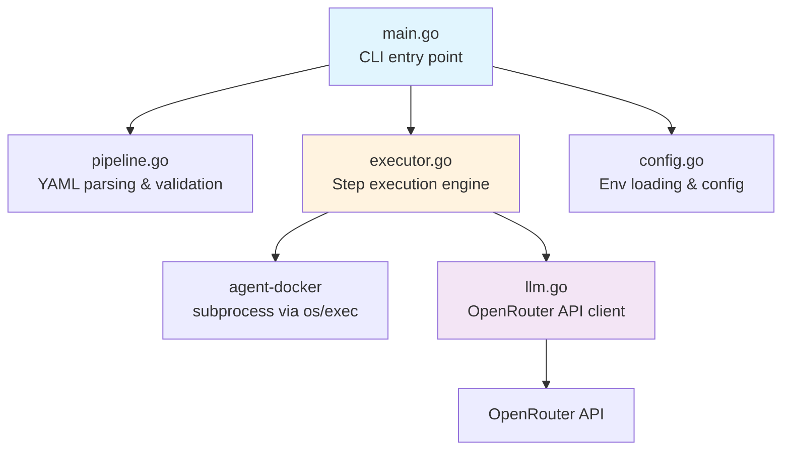
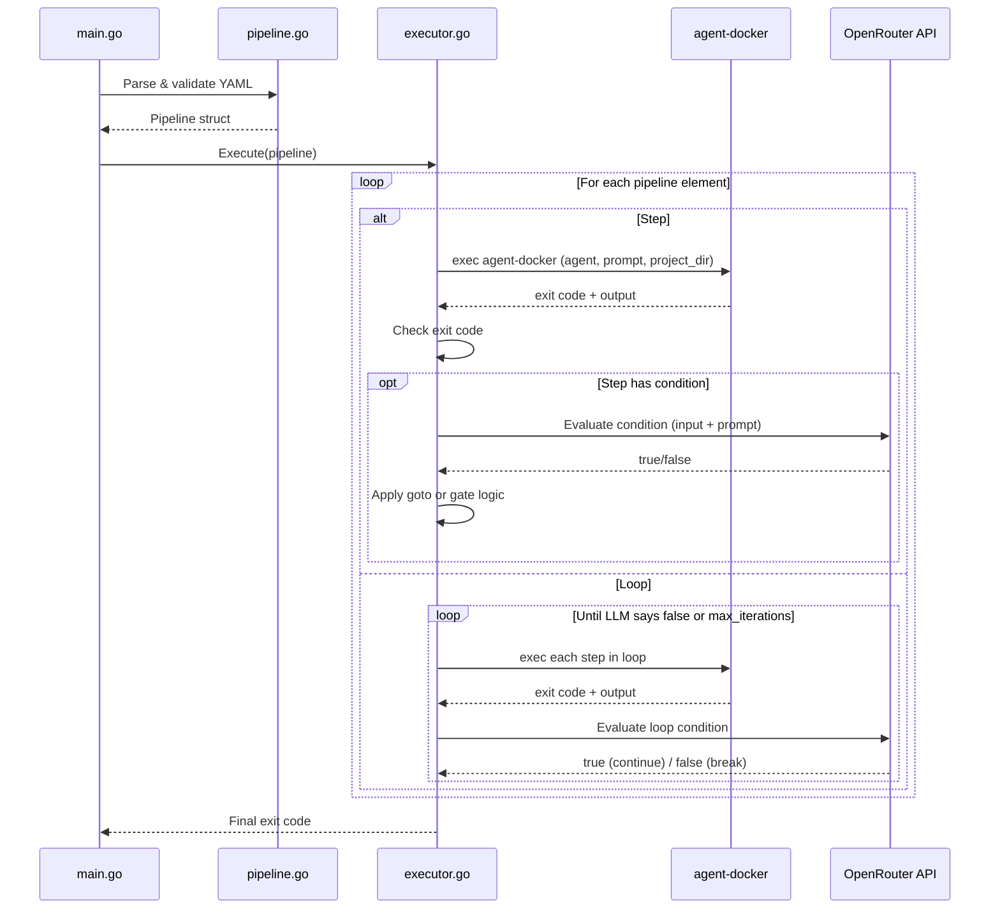

# Design Document: Agent Orchestrator

## Overview

The Agent Orchestrator is a Go CLI that reads a YAML pipeline definition and executes a sequence of `agent-docker` commands. It supports linear step execution, LLM-based loops (iterative refinement), and step-level conditions with optional goto jumps. LLM evaluations are performed via the OpenRouter API.

The orchestrator compiles into a single static binary with no runtime dependencies beyond the Go standard library and the `agent-docker` script on PATH. It lives in the `orchestrator/` directory.

### Key Design Decisions

1. **YAML parsing via `gopkg.in/yaml.v3`** — the standard Go YAML library, well-maintained and sufficient for our schema. This is the only external dependency besides `github.com/joho/godotenv` for .env loading.
2. **Flat source structure** — the orchestrator has ~6-7 source files, staying under the 8-file threshold for flat layout per project rules.
3. **`os/exec` for subprocess management** — Go's standard library provides everything needed to spawn `agent-docker`, stream output, and capture exit codes.
4. **`net/http` for OpenRouter API** — no need for an HTTP client library; the standard library handles JSON POST requests fine.
5. **Pipeline as a typed Go struct** — the YAML is deserialized into strongly-typed Go structs with validation at parse time, failing fast on invalid configurations.

## Architecture



### Execution Flow



## Components and Interfaces

### File Layout

```
orchestrator/
├── main.go          # CLI entry point, flag parsing, orchestration
├── config.go        # Environment loading, configuration struct
├── pipeline.go      # YAML parsing, validation, pipeline types
├── executor.go      # Step execution, loop handling, condition routing
├── llm.go           # OpenRouter API client, LLM decision parsing
├── go.mod
└── go.sum
```

### main.go — CLI Entry Point

Parses CLI flags (`--pipeline`, `--dry-run`), loads config, parses the pipeline file, and delegates to the executor.

```go
// Flags
--pipeline string   // Path to pipeline YAML file (required)
--dry-run           // Print steps without executing
--verbose           // Stream agent-docker output to stdout in real time
--version           // Print version and exit
--help, -h          // Print usage with description and examples
```

When invoked with no flags, invalid flags, or missing `--pipeline`, the CLI prints usage help to stderr and exits with code 1. The help output includes a description, all flags, and usage examples:

```
Agent Orchestrator — sequential AI agent pipeline runner

Usage:
  orchestrator --pipeline <path> [--dry-run] [--verbose]
  orchestrator --version
  orchestrator --help

Flags:
  --pipeline string   Path to pipeline YAML file (required)
  --dry-run           Print pipeline steps without executing
  --verbose           Stream agent-docker output to stdout in real time
  --version           Print version and exit
  --help, -h          Show this help message

Examples:
  orchestrator --pipeline workflow.yaml
  orchestrator --pipeline workflow.yaml --verbose
  orchestrator --pipeline workflow.yaml --dry-run
```

The version string is set at build time via `-ldflags`:
```bash
go build -ldflags "-X main.version=1.0.0" -o orchestrator .
```

### config.go — Configuration

```go
type Config struct {
    OpenRouterAPIKey string // from OPENROUTER_API_KEY
    OpenRouterModel  string // from OPENROUTER_MODEL, default: "openai/gpt-4.1-nano"
}
```

- Loads `.env` from cwd using `godotenv` (silent if missing)
- Validates that `OPENROUTER_API_KEY` is set when the pipeline contains conditions
- Passes through all host env vars to subprocesses

### pipeline.go — Pipeline Parsing & Validation

Responsible for deserializing the YAML pipeline file into typed Go structs and running all validation checks.

```go
// ParsePipeline reads and validates a YAML pipeline file.
func ParsePipeline(path string) (*Pipeline, error)

// FlattenStepNames returns all step names across the pipeline (top-level + inside loops).
func (p *Pipeline) FlattenStepNames() []string

// NeedsLLM returns true if any element in the pipeline has a condition.
func (p *Pipeline) NeedsLLM() bool
```

Validation rules (all checked at parse time):
- File exists and is valid YAML
- Each step has `name`, `agent`, `prompt`
- `agent` is `kiro` or `claude`
- All step names are unique across the entire pipeline (including inside loops)
- Loop objects have `max_iterations` (> 0), `steps`, and `condition`
- Condition objects have `prompt`
- Goto targets reference existing step names

### executor.go — Execution Engine

The core execution loop. Handles sequential steps, loops, conditions, and goto jumps.

```go
type Executor struct {
    Config    *Config
    Pipeline  *Pipeline
    LLM       *LLMClient
    DryRun    bool
    Verbose   bool
}

// Run executes the entire pipeline. Returns the final exit code.
func (e *Executor) Run() int

// executeStep runs a single agent-docker subprocess.
// Returns the captured output and exit code.
func (e *Executor) executeStep(step *Step, stepNum int, totalSteps int) (string, int, error)

// executeLoop runs a loop block with LLM-based iteration control.
func (e *Executor) executeLoop(loop *Loop) error

// evaluateCondition sends content to the LLM and returns the boolean decision.
func (e *Executor) evaluateCondition(cond *Condition, input string) (bool, error)
```

Step execution details:
- Builds the `agent-docker` command: `agent-docker <agent> -p <project_dir> <prompt>`
- Uses `os/exec.Command` with output always captured to a buffer for condition input
- When `--verbose` is set, uses `io.MultiWriter` to stream output to both os.Stdout/os.Stderr and the capture buffer simultaneously
- When `--verbose` is not set, output is captured to the buffer only (not printed to terminal)
- Progress log lines (step start, completion, elapsed time) are always printed regardless of verbose mode
- Waits for completion, extracts exit code
- Logs step name, agent type, elapsed time, success/failure

Goto implementation:
- The executor maintains a flat index of all top-level pipeline elements
- When a goto fires, the executor sets the next execution index to the target step's position
- Goto can only target top-level steps (not steps inside loops)

### llm.go — OpenRouter API Client

```go
type LLMClient struct {
    APIKey  string
    Model   string
    BaseURL string // "https://openrouter.ai/api/v1/chat/completions"
}

// Evaluate sends content + prompt to the LLM and returns a boolean decision.
// Retries once on failure.
func (c *LLMClient) Evaluate(content string, conditionPrompt string) (bool, error)
```

LLM interaction details:
- System prompt (English): instructs the LLM to evaluate the content based on the condition prompt and respond with exactly `true` or `false`
- User message: contains the condition prompt and the content (file or step output)
- Response parsing: extracts `true`/`false` from the LLM response content, case-insensitive, trimmed
- Retry logic: on HTTP error or unparseable response, retries once; if retry fails, returns error
- Uses `net/http` with a 60-second timeout

System prompt:
```
You are a pipeline condition evaluator. You will receive content and a condition to evaluate.
Analyze the content based on the condition and respond with exactly one word: true or false.
Do not include any other text, explanation, or formatting.
```

## Data Models

### Pipeline YAML Schema

```yaml
steps:
  # Simple step
  - name: "create-code"
    agent: "claude"
    prompt: "Read the spec and create the code"
    project_dir: "/path/to/project"  # optional, defaults to cwd

  # Step with condition (gate — no goto)
  - name: "test"
    agent: "kiro"
    prompt: "Run all tests"
    condition:
      prompt: "Do all tests pass based on the output?"
      # no file → uses step output
      # no goto → true=continue, false=stop pipeline

  # Step with condition (goto)
  - name: "review"
    agent: "kiro"
    prompt: "Review the code and write CODE_REVIEW.md"
    condition:
      prompt: "Are there critical issues that need fixing?"
      file: "CODE_REVIEW.md"
      goto: "fix-code"  # jump to this step if true

  # Loop
  - loop:
      max_iterations: 3
      condition:
        prompt: "Are there still failing tests that need fixing?"
        file: "test-results.txt"
      steps:
        - name: "run-tests"
          agent: "claude"
          prompt: "Run the test suite and save results to test-results.txt"
        - name: "fix-tests"
          agent: "claude"
          prompt: "Fix the failing tests"
```

### Go Types

```go
// Pipeline is the top-level structure parsed from the YAML file.
type Pipeline struct {
    Elements []PipelineElement // ordered list of steps and loops
}

// PipelineElement is either a Step or a Loop.
type PipelineElement struct {
    Step *Step
    Loop *Loop
}

// Step represents a single agent-docker invocation.
type Step struct {
    Name       string     `yaml:"name"`
    Agent      string     `yaml:"agent"`
    Prompt     string     `yaml:"prompt"`
    ProjectDir string     `yaml:"project_dir"`
    Condition  *Condition `yaml:"condition"`
}

// Loop represents a repeatable block of steps with an LLM condition.
type Loop struct {
    MaxIterations int        `yaml:"max_iterations"`
    Steps         []Step     `yaml:"steps"`
    Condition     Condition  `yaml:"condition"`
}

// Condition represents an LLM-based evaluation.
type Condition struct {
    Prompt string `yaml:"prompt"`
    File   string `yaml:"file"`
    Goto   string `yaml:"goto"`
}
```

### Custom YAML Unmarshaling

The `steps` list in the YAML contains a mix of step objects and loop objects. We implement `UnmarshalYAML` on `PipelineElement` to distinguish between them:

- If the YAML node contains a `loop` key → parse as Loop
- Otherwise → parse as Step

This keeps the YAML format clean and avoids wrapper types.

### OpenRouter API Request/Response

```go
// LLMRequest is the request body for the OpenRouter chat completions API.
type LLMRequest struct {
    Model    string       `json:"model"`
    Messages []LLMMessage `json:"messages"`
}

type LLMMessage struct {
    Role    string `json:"role"`
    Content string `json:"content"`
}

// LLMResponse is the response from the OpenRouter API.
type LLMResponse struct {
    Choices []struct {
        Message struct {
            Content string `json:"content"`
        } `json:"message"`
    } `json:"choices"`
}
```


## Correctness Properties

*A property is a characteristic or behavior that should hold true across all valid executions of a system — essentially, a formal statement about what the system should do. Properties serve as the bridge between human-readable specifications and machine-verifiable correctness guarantees.*

### Property 1: Pipeline parsing round trip

*For any* valid Pipeline struct (with valid agent types, unique names, valid conditions, and valid loops), serializing it to YAML and parsing it back with `ParsePipeline` should produce a structurally equivalent Pipeline.

**Validates: Requirements 1.2, 1.3, 8.2, 8.4, 8.9**

### Property 2: Invalid pipelines are rejected

*For any* pipeline YAML that contains at least one validation violation (invalid agent type, duplicate step names, missing required fields, condition without prompt, goto referencing non-existent step, max_iterations ≤ 0, or missing loop fields), `ParsePipeline` should return a non-nil error.

**Validates: Requirements 1.4, 1.5, 1.6, 1.7, 1.8, 8.2, 8.6, 8.7, 8.8, 8.9, 8.11, 8.12, 8.13**

### Property 3: Command construction correctness

*For any* Step with a given agent type, prompt, and optional project directory, the constructed `agent-docker` command should contain the agent type and prompt as arguments, and should include `-p <project_dir>` when project_dir is specified or `-p <cwd>` when it is not.

**Validates: Requirements 2.2, 2.3, 2.4**

### Property 4: Sequential execution order

*For any* pipeline of N steps (including steps inside loops during a single iteration), the executor should invoke steps in exactly the order they appear in the pipeline definition, and the total number of invocations should equal N (assuming all steps succeed and no conditions alter flow).

**Validates: Requirements 2.1, 9.1**

### Property 5: Failure stops pipeline

*For any* pipeline where step at index K fails (non-zero exit code), only steps 0 through K should be executed, and the pipeline should exit with a non-zero exit code. This applies to both top-level steps and steps inside loops.

**Validates: Requirements 3.2, 3.3, 3.4, 9.10**

### Property 6: Condition input selection

*For any* condition (on a step or loop) that specifies a `file` field, the condition evaluator should receive the file's content as input. *For any* condition that does not specify a `file` field, the evaluator should receive the step output (or last loop step output) as input.

**Validates: Requirements 2.7, 9.2, 10.1**

### Property 7: Loop iteration control

*For any* loop with max_iterations M, if the LLM returns `true` for the first K iterations (K < M) and `false` on iteration K+1, the loop should execute exactly K+1 iterations. If the LLM returns `true` for all M iterations, the loop should execute exactly M iterations and then exit with a warning.

**Validates: Requirements 9.6, 9.7, 9.8**

### Property 8: Step condition routing

*For any* step with a condition: (a) if the condition has a `goto` and LLM returns `true`, the next executed step should be the goto target; (b) if the condition has a `goto` and LLM returns `false`, the next executed step should be the sequential next step; (c) if the condition has no `goto` and LLM returns `true`, the next executed step should be the sequential next step; (d) if the condition has no `goto` and LLM returns `false`, the pipeline should stop with exit code 0.

**Validates: Requirements 10.5, 10.6, 10.7, 10.8**

### Property 9: LLM client retry on failure

*For any* LLM request that fails on the first attempt (HTTP error or unparseable response), the client should retry exactly once. If the retry succeeds, the result should be returned. If the retry also fails, an error should be returned.

**Validates: Requirements 10.10**

### Property 10: Dry run prints all steps without execution

*For any* pipeline in dry-run mode, the output should contain each step's number, agent type, project directory, and prompt, and no `agent-docker` subprocess should be spawned.

**Validates: Requirements 7.1, 7.2**

### Property 11: API key required when pipeline needs LLM

*For any* pipeline that contains at least one condition (on a step or in a loop), if `OPENROUTER_API_KEY` is not set, the orchestrator should exit with a non-zero exit code before executing any steps.

**Validates: Requirements 5.6**

### Property 12: LLM response parsing

*For any* LLM response string, the parser should extract `true` when the response contains "true" (case-insensitive, ignoring whitespace) and `false` when it contains "false". Any other content should be treated as unparseable.

**Validates: Requirements 9.5, 10.4**

## Error Handling

### Parse-Time Errors (fail fast)

| Error | Behavior |
|-------|----------|
| Pipeline file not found | Exit 1, stderr: `error: pipeline file not found: <path>` |
| Invalid YAML syntax | Exit 1, stderr: `error: invalid YAML in pipeline file: <details>` |
| Missing required step fields | Exit 1, stderr: `error: step "<name>": missing required field "<field>"` |
| Invalid agent type | Exit 1, stderr: `error: step "<name>": invalid agent type "<type>", must be "kiro" or "claude"` |
| Duplicate step name | Exit 1, stderr: `error: duplicate step name "<name>"` |
| Goto references non-existent step | Exit 1, stderr: `error: step "<name>": goto target "<target>" not found` |
| Condition missing prompt | Exit 1, stderr: `error: step "<name>": condition requires a "prompt" field` |
| Loop missing required fields | Exit 1, stderr: `error: loop: missing required field "<field>"` |
| max_iterations ≤ 0 | Exit 1, stderr: `error: loop: max_iterations must be a positive integer` |
| API key missing when needed | Exit 1, stderr: `error: OPENROUTER_API_KEY is required when pipeline contains conditions` |

### Runtime Errors

| Error | Behavior |
|-------|----------|
| agent-docker not found on PATH | Exit 1, stderr: `error: agent-docker not found on PATH` |
| Step exits with non-zero code | Exit with same code, stderr: `error: step "<name>" failed with exit code <code>` |
| Condition file not found | Exit 1, stderr: `error: step "<name>": condition file not found: <path>` |
| OpenRouter API HTTP error | Retry once; if retry fails, exit 1 with stderr: `error: LLM request failed after retry: <details>` |
| OpenRouter API unparseable response | Retry once; if retry fails, exit 1 with stderr: `error: LLM returned unparseable response after retry` |

### Error Design Principles

1. All errors go to stderr, all progress/output goes to stdout
2. Error messages always identify the failing step by name
3. Parse-time validation catches as many errors as possible before execution begins
4. The orchestrator never silently swallows errors

## Testing Strategy

### Testing Framework

- **Unit/integration tests**: Go's built-in `testing` package
- **Property-based tests**: `pgregory.net/rapid` — a mature Go property-based testing library with good shrinking support
- **No external test dependencies** beyond `rapid`

### Test File Layout

```
orchestrator/
├── pipeline_test.go    # Parsing, validation, round-trip properties
├── executor_test.go    # Execution order, failure handling, condition routing
├── llm_test.go         # LLM client, retry logic, response parsing
├── main_test.go        # CLI flag parsing, dry-run, integration
```

### Unit Tests

Unit tests cover specific examples and edge cases:

- Parse a known-good pipeline YAML and verify struct fields
- Parse a pipeline with multi-line prompts (YAML block scalars)
- Validate error messages for each type of validation failure
- Verify `.env` loading when file exists and when it doesn't
- Verify default model is used when `OPENROUTER_MODEL` is not set
- Verify dry-run output format for a sample pipeline
- Verify elapsed time is printed after step completion
- Verify total pipeline time is printed at completion

### Property-Based Tests

Each property test runs a minimum of 100 iterations using `rapid`. Each test is tagged with a comment referencing the design property.

| Test | Property | Description |
|------|----------|-------------|
| `TestPipelineRoundTrip` | Property 1 | Generate random valid Pipeline structs, serialize to YAML, parse back, assert equivalence |
| `TestInvalidPipelineRejected` | Property 2 | Generate pipelines with random validation violations, assert ParsePipeline returns error |
| `TestCommandConstruction` | Property 3 | Generate random steps, verify constructed command contains correct args |
| `TestSequentialExecution` | Property 4 | Generate random pipelines, mock executor, verify call order matches definition |
| `TestFailureStopsPipeline` | Property 5 | Generate pipelines with a random failing step, verify only steps up to failure execute |
| `TestConditionInputSelection` | Property 6 | Generate conditions with/without file field, verify correct input is passed to LLM |
| `TestLoopIterationControl` | Property 7 | Generate loops with random max_iterations and LLM decision sequences, verify iteration count |
| `TestStepConditionRouting` | Property 8 | Generate steps with conditions (with/without goto, true/false), verify next step selection |
| `TestLLMRetry` | Property 9 | Generate random failure/success sequences, verify retry behavior |
| `TestDryRunNoExecution` | Property 10 | Generate random pipelines, run in dry-run mode, verify no subprocess spawned |
| `TestAPIKeyRequired` | Property 11 | Generate pipelines with conditions, unset API key, verify error before execution |
| `TestLLMResponseParsing` | Property 12 | Generate random strings, verify true/false extraction or unparseable result |

### Test Isolation

- Subprocess execution is abstracted behind an interface (`CommandRunner`) so tests can use a mock implementation
- LLM calls are abstracted behind an interface (`ConditionEvaluator`) so tests can inject deterministic responses
- File I/O for condition files uses `os.ReadFile` which can be tested with temp directories

### Test Interfaces for Mocking

```go
// CommandRunner abstracts subprocess execution for testability.
type CommandRunner interface {
    Run(agent string, prompt string, projectDir string, env []string) (output string, exitCode int, err error)
}

// ConditionEvaluator abstracts LLM condition evaluation for testability.
type ConditionEvaluator interface {
    Evaluate(content string, conditionPrompt string) (bool, error)
}
```
