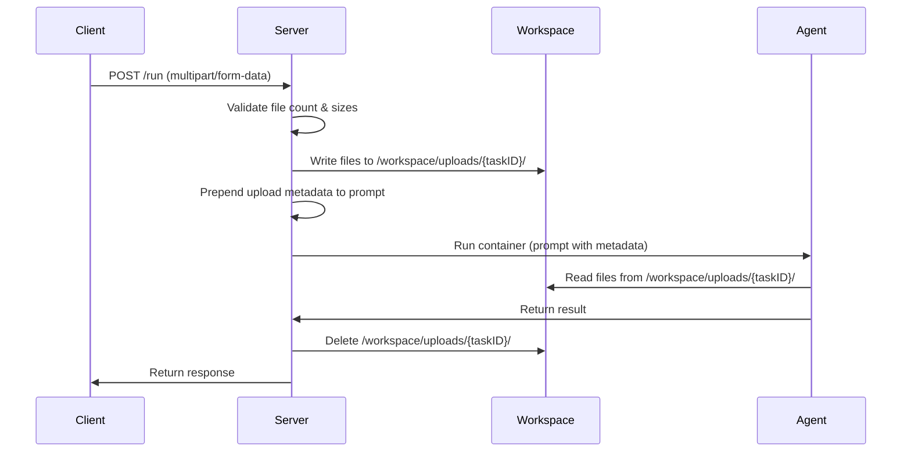
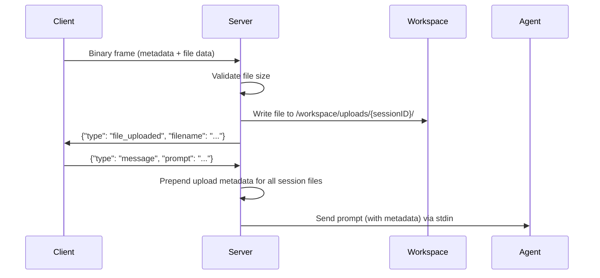

# Design Document: File Upload with Prompt

## Overview

This feature extends the trayline API server and CLI client to support file uploads alongside text prompts. Files are uploaded via multipart/form-data (REST) or binary WebSocket frames (chat), stored in the shared workspace, and made available to agent containers. The server prepends upload metadata to the prompt so agents know where files are located.

The design preserves full backward compatibility — existing JSON-only requests continue to work unchanged.

## Architecture

### Upload Flow (REST)



### Upload Flow (WebSocket)



### Workspace Directory Layout

```
/workspace/
├── uploads/
│   ├── {taskID}/           # one-shot task files (cleaned up on completion)
│   │   ├── report.pdf
│   │   └── data.csv
│   └── {sessionID}/        # chat session files (cleaned up on termination)
│       ├── image.png
│       └── config.yaml
└── ... (existing workspace content)
```

## Components and Interfaces

### New/Modified Files — Server

```
server/
├── api/
│   ├── task_handler.go      # Modified: add multipart parsing in HandlePostRun
│   ├── task_types.go        # Modified: no struct changes needed (files extracted from multipart)
│   ├── session_handler.go   # Modified: handle binary WS frames for file upload
│   ├── session_types.go     # Modified: add file_uploaded server message type
│   └── upload.go            # NEW: file upload handling, validation, metadata generation
├── core/
│   └── config.go            # Modified: add MAX_UPLOAD_SIZE, MAX_UPLOAD_FILES config
└── docker/
    └── container.go         # No changes needed (workspace already mounted)
```

### New/Modified Files — Client

```
client/
├── api.go          # Modified: add PostRunMultipart method
├── run.go          # Modified: add --file flag, construct multipart when files present
├── chat.go         # Modified: handle /file command and binary frame sending
└── types.go        # Modified: add FileUploadAck message type
```

### Upload Handler (`server/api/upload.go`)

New file responsible for file handling logic shared between REST and WebSocket paths.

```go
package api

import (
    "fmt"
    "io"
    "mime/multipart"
    "os"
    "path/filepath"
    "strings"
)

const (
    MaxUploadFileSize  = 50 * 1024 * 1024  // 50 MB per file
    MaxUploadFileCount = 10                 // max files per request
    uploadSubdir       = "uploads"
)

// UploadedFile describes a single file that was stored in the workspace.
type UploadedFile struct {
    OriginalName string  // original filename from the upload
    WorkspacePath string // path relative to workspace root (e.g., "uploads/{id}/file.txt")
}

// SaveUploadedFiles validates and saves multipart files to the workspace.
// Returns the list of saved files or an error if validation fails.
// On validation failure, no files are written.
func SaveUploadedFiles(files []*multipart.FileHeader, workspaceDir, subdir string) ([]UploadedFile, error) {
    if len(files) > MaxUploadFileCount {
        return nil, fmt.Errorf("request contains %d files, maximum allowed is %d", len(files), MaxUploadFileCount)
    }

    // Pre-validate all file sizes before writing any
    for _, fh := range files {
        if fh.Size > MaxUploadFileSize {
            return nil, fmt.Errorf("file %q exceeds maximum size of %d bytes (got %d bytes)", fh.Filename, MaxUploadFileSize, fh.Size)
        }
    }

    destDir := filepath.Join(workspaceDir, uploadSubdir, subdir)
    if err := os.MkdirAll(destDir, 0755); err != nil {
        return nil, fmt.Errorf("failed to create upload directory: %w", err)
    }

    var uploaded []UploadedFile
    for _, fh := range files {
        safeName := sanitizeFilename(fh.Filename)
        destPath := filepath.Join(destDir, safeName)

        if err := saveFile(fh, destPath); err != nil {
            // Clean up already-written files on failure
            cleanupUploadDir(destDir)
            return nil, fmt.Errorf("failed to save file %q: %w", fh.Filename, err)
        }

        uploaded = append(uploaded, UploadedFile{
            OriginalName:  fh.Filename,
            WorkspacePath: filepath.Join(uploadSubdir, subdir, safeName),
        })
    }

    return uploaded, nil
}

// SaveSingleFile validates and saves a single file from a WebSocket binary frame.
func SaveSingleFile(filename string, data []byte, workspaceDir, subdir string) (*UploadedFile, error) {
    if int64(len(data)) > MaxUploadFileSize {
        return nil, fmt.Errorf("file %q exceeds maximum size of %d bytes (got %d bytes)", filename, MaxUploadFileSize, len(data))
    }

    destDir := filepath.Join(workspaceDir, uploadSubdir, subdir)
    if err := os.MkdirAll(destDir, 0755); err != nil {
        return nil, fmt.Errorf("failed to create upload directory: %w", err)
    }

    safeName := sanitizeFilename(filename)
    destPath := filepath.Join(destDir, safeName)

    if err := os.WriteFile(destPath, data, 0644); err != nil {
        return nil, fmt.Errorf("failed to write file: %w", err)
    }

    return &UploadedFile{
        OriginalName:  filename,
        WorkspacePath: filepath.Join(uploadSubdir, subdir, safeName),
    }, nil
}

// BuildUploadMetadata constructs the metadata block to prepend to the prompt.
func BuildUploadMetadata(files []UploadedFile) string {
    if len(files) == 0 {
        return ""
    }

    var sb strings.Builder
    sb.WriteString("[Uploaded Files]\n")
    for _, f := range files {
        sb.WriteString(fmt.Sprintf("- %s → /workspace/%s\n", f.OriginalName, f.WorkspacePath))
    }
    sb.WriteString("\n")
    return sb.String()
}

// CleanupUploadDir removes the upload directory for a task or session.
// Returns any error encountered (caller decides whether to log or ignore).
func CleanupUploadDir(workspaceDir, subdir string) error {
    dir := filepath.Join(workspaceDir, uploadSubdir, subdir)
    return os.RemoveAll(dir)
}

// sanitizeFilename removes path traversal and unsafe characters from a filename.
func sanitizeFilename(name string) string {
    // Take only the base name (strip directory components)
    name = filepath.Base(name)
    // Replace path separators that might slip through
    name = strings.ReplaceAll(name, "..", "_")
    if name == "" || name == "." {
        name = "unnamed"
    }
    return name
}

func saveFile(fh *multipart.FileHeader, destPath string) error {
    src, err := fh.Open()
    if err != nil {
        return err
    }
    defer src.Close()

    dst, err := os.Create(destPath)
    if err != nil {
        return err
    }
    defer dst.Close()

    _, err = io.Copy(dst, src)
    return err
}

func cleanupUploadDir(dir string) {
    _ = os.RemoveAll(dir)
}
```

### Modified Task Handler (`HandlePostRun`)

The handler detects `Content-Type`:
- If `multipart/form-data`: parse multipart form, extract files and JSON fields from form fields
- If `application/json`: existing behavior unchanged

```go
// Content-type detection in HandlePostRun
contentType := r.Header.Get("Content-Type")
if strings.HasPrefix(contentType, "multipart/form-data") {
    // Parse multipart: "prompt", "agent", "model", "system", "output_format" as form fields
    // Files in "files" field
    // Validate, save files, prepend metadata to prompt
} else {
    // Existing JSON decode path (unchanged)
}
```

### WebSocket Binary Frame Protocol

For file uploads during chat sessions, the client sends a binary WebSocket frame with a simple header:

```
[4 bytes: filename length (big-endian uint32)]
[N bytes: filename (UTF-8)]
[remaining bytes: file content]
```

The server parses this format, saves the file, and sends back a JSON text message:

```json
{"type": "file_uploaded", "data": "report.pdf"}
```

On error:
```json
{"type": "error", "message": "file \"big.zip\" exceeds maximum size of 52428800 bytes"}
```

### Modified Client `PostRun` method

New method `PostRunMultipart` that sends files via `multipart/form-data`:

```go
func (c *APIClient) PostRunMultipart(req RunRequest, files []string) (*RunResponse, *RunAcceptedResponse, error) {
    // Create multipart writer
    // Add form fields: prompt, agent, model, system, output_format
    // Add each file under field name "files"
    // Set Content-Type to multipart writer's FormDataContentType()
    // Send request with increased timeout for large uploads
}
```

### Modified Client `run` command

New `--file` flag (repeatable):

```
trayline-client run --agent kiro --prompt "Analyze this CSV" --file data.csv --file schema.json
```

### Modified Client chat `/file` command

During an active chat session, the user can type:

```
/file ./path/to/document.pdf
```

The client reads the file, constructs the binary frame, and sends it over the WebSocket.

### Server Message Types Update

Add new WSServerMessage type value:

```go
// WSServerMessage types:
// "session_started", "session_resumed", "output", "done",
// "error", "terminated", "context_compacted", "file_uploaded"  ← NEW
```

## Data Models

### No New Persistent Data Models

Files are transient — stored on disk during task/session lifetime, deleted on completion/termination. No database or state file changes needed.

The `Task` and `Session` structs gain no new fields since the upload directory path is deterministic from the ID (`uploads/{id}/`).

### Upload Metadata Format

Prepended to the prompt as plain text:

```
[Uploaded Files]
- report.pdf → /workspace/uploads/abc-123/report.pdf
- data.csv → /workspace/uploads/abc-123/data.csv

<original prompt here>
```

This format is simple, human-readable, and easily parsed by LLM agents.

## Configuration

### New Environment Variables

| Variable | Default | Description |
|----------|---------|-------------|
| `MAX_UPLOAD_SIZE` | `52428800` (50 MB) | Maximum size in bytes per uploaded file |
| `MAX_UPLOAD_FILES` | `10` | Maximum number of files per request |

These are optional — defaults are sensible for most deployments.

## Error Handling

### REST Upload Errors

| Condition | HTTP Status | Error Code | Message |
|-----------|-------------|------------|---------|
| Too many files | 400 | VALIDATION_ERROR | "request contains N files, maximum allowed is 10" |
| File too large | 400 | VALIDATION_ERROR | "file \"X\" exceeds maximum size of 52428800 bytes (got Y bytes)" |
| Multipart parse error | 400 | VALIDATION_ERROR | "failed to parse multipart form: ..." |
| Missing prompt in multipart | 400 | VALIDATION_ERROR | "prompt is required and must not be empty" |
| Filesystem write failure | 500 | INTERNAL_ERROR | "failed to store uploaded files" |

### WebSocket Upload Errors

| Condition | Message Type | Message |
|-----------|-------------|---------|
| File too large | error | "file \"X\" exceeds maximum size of 52428800 bytes" |
| Invalid binary frame format | error | "invalid file upload frame format" |
| Filesystem write failure | error | "failed to store uploaded file" |

### Cleanup Errors

File cleanup errors on task/session completion are logged at `warn` level but never propagate to the client or affect task status.

## Backward Compatibility

- `POST /run` with `Content-Type: application/json` works exactly as before
- WebSocket text messages work exactly as before
- No changes to existing response formats
- The `--file` flag is optional; omitting it preserves current behavior
- No new required environment variables

## Correctness Properties

### Property 1: Multipart request with valid files produces stored files matching input

*For any* set of 1–10 files, each with a non-empty filename and content of 1 byte to 50 MB, submitting them in a multipart POST /run request with a valid prompt and agent shall result in exactly that many files stored in the workspace under `uploads/{taskID}/`, each with content identical to the input and a filename derived from the original.

**Validates: Requirements 1.1, 1.2, 1.3**

### Property 2: Upload metadata contains one entry per file with correct paths

*For any* list of uploaded files with arbitrary valid filenames, `BuildUploadMetadata` shall produce a string containing exactly N entries (one per file), where each entry includes the original filename and the workspace path `uploads/{subdir}/{sanitized_name}`.

**Validates: Requirements 6.1, 6.2**

### Property 3: No metadata prepended when no files uploaded

*For any* valid prompt submitted without files (either JSON or empty multipart files field), the prompt passed to the agent shall be identical to the original prompt (possibly with output format suffix), with no upload metadata prefix.

**Validates: Requirements 6.3, 1.4**

### Property 4: File count validation rejects requests exceeding limit

*For any* multipart request containing more than `MaxUploadFileCount` files, `SaveUploadedFiles` shall return an error and shall not create any files in the workspace directory.

**Validates: Requirements 3.2, 3.4, 3.5**

### Property 5: File size validation rejects oversized files without writing

*For any* multipart request where at least one file exceeds `MaxUploadFileSize`, `SaveUploadedFiles` shall return an error identifying the offending file and shall not create any files in the workspace directory.

**Validates: Requirements 3.1, 3.3, 3.5**

### Property 6: Filename sanitization prevents path traversal

*For any* filename string (including those containing `..`, `/`, `\`, or null bytes), `sanitizeFilename` shall produce a result that: (a) does not contain path separator characters or `..` sequences, (b) is non-empty, and (c) when joined with a base directory, resolves to a path within that base directory.

**Validates: Requirements 1.2 (safe storage)**

### Property 7: JSON request backward compatibility

*For any* valid `RunRequest` JSON body (non-empty prompt ≤32000 chars, valid agent), submitting it as `application/json` to POST /run shall produce the same acceptance behavior (200 or 202) as before the feature was added — no regression in existing functionality.

**Validates: Requirements 1.4**

### Property 8: Binary frame round-trip (WebSocket)

*For any* filename (≤255 bytes UTF-8) and file content (1 byte to 50 MB), encoding them into the binary frame format and then decoding shall produce the original filename and content unchanged.

**Validates: Requirements 2.1**

## Testing Strategy

### Property-Based Testing

Uses `pgregory.net/rapid` consistent with the rest of the project.

| Property | Test File | Description |
|----------|-----------|-------------|
| Property 1 | `upload_test.go` | SaveUploadedFiles stores correct files |
| Property 2 | `upload_test.go` | BuildUploadMetadata format correctness |
| Property 3 | `task_handler_test.go` | No metadata on file-less requests |
| Property 4 | `upload_test.go` | Count validation rejects and leaves no files |
| Property 5 | `upload_test.go` | Size validation rejects and leaves no files |
| Property 6 | `upload_test.go` | sanitizeFilename prevents traversal |
| Property 7 | `task_handler_test.go` | JSON path unchanged |
| Property 8 | `upload_test.go` | Binary frame encode/decode round-trip |

### Unit Tests (Example-Based)

- Multipart parsing with zero files (should work, just prompt)
- Multipart parsing with exactly 10 files at exactly 50 MB (boundary)
- WebSocket binary frame with empty filename (rejected)
- `/file` command with non-existent path (client error)
- Cleanup on task completion verifies directory removal
- Cleanup failure is logged but task still completes successfully

### Integration Tests

- Full lifecycle: upload files → task runs → agent sees files → task completes → files cleaned up
- WebSocket: upload file → send message → agent response references file → session terminates → files cleaned up
- Concurrent uploads: two tasks with same filename don't collide (different subdirectories)
