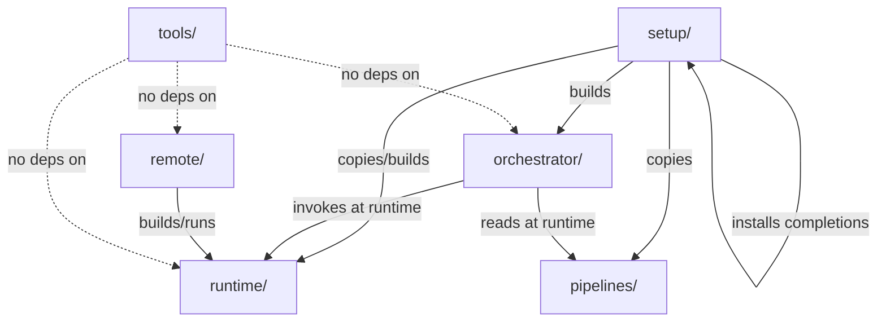

# Design Document: Monorepo Restructure

## Overview

This design describes the structural reorganization of the `trayline/` monorepo from a flat layout (where every component lives at the repo root) into 7 clearly delineated top-level directories. The restructuring is purely organizational — no business logic changes.

The primary technical challenge is merging `server/` and `client/` (two independent Go modules) into a single Go module under `remote/`, which requires creating a unified `go.mod`, reorganizing source files into `cmd/server/` and `cmd/client/` entry points, and updating all internal import paths to reference the new module name.

### Target Directory Layout

```
trayline/
├── .agents/              # AI agent working files (unchanged)
├── .kiro/                # Kiro specs (unchanged)
├── runtime/              # Execution artifacts (scripts + sandbox Dockerfile)
│   ├── sandbox/
│   │   └── Dockerfile
│   ├── trayline
│   ├── trayline-agent
│   └── sync.sh
├── orchestrator/         # Pipeline orchestrator Go module (unchanged)
├── pipelines/            # YAML pipeline definitions (unchanged)
├── remote/               # Merged server + client Go module
│   ├── cmd/
│   │   ├── server/
│   │   │   └── main.go
│   │   └── client/
│   │       └── main.go
│   ├── api/
│   ├── core/
│   ├── docker/
│   ├── store/
│   ├── scripts/
│   ├── go.mod
│   └── go.sum
├── tools/                # Independent utilities
│   ├── taskline/
│   │   ├── server/
│   │   └── cli/
│   └── tunnel/
├── setup/                # Installation and configuration
│   ├── install.sh
│   ├── config.example
│   ├── .rsyncignore
│   └── completions/
│       └── _trayline
├── .gitignore
├── README.md
└── CLAUDE.md
```

## Architecture

The restructuring does not change the runtime architecture or dependency graph between components. It makes the existing implicit dependency direction explicit in the filesystem layout:



### Dependency Rules (enforced by convention)

| Directory | Allowed dependencies |
|-----------|---------------------|
| `runtime/` | None (pure scripts/config) |
| `orchestrator/` | `runtime/` (runtime invocation), `pipelines/` (runtime file reads) |
| `pipelines/` | None (data files) |
| `remote/` | `runtime/` (uses sandbox image at runtime) |
| `tools/` | None (fully self-contained) |
| `setup/` | All other directories (via path references in install script) |

## Components and Interfaces

### 1. runtime/ — Execution Artifacts

Contains all scripts and the Dockerfile needed during normal trayline usage. Files move here from their current locations:

| Target | Source |
|--------|--------|
| `runtime/sandbox/Dockerfile` | `Dockerfile` (root) |
| `runtime/trayline` | `scripts/trayline` |
| `runtime/trayline-agent` | `scripts/trayline-agent` |
| `runtime/sync.sh` | `scripts/sync.sh` |

No content changes — byte-for-byte identical. Executable permissions preserved.

### 2. orchestrator/ — Pipeline Orchestrator (unchanged)

Stays at `orchestrator/` with no modifications. Module path remains `module orchestrator`. Go 1.23.6.

### 3. pipelines/ — Pipeline Definitions (unchanged)

Stays at `pipelines/` with no modifications to YAML content. The pipeline references use logical names resolved by the `trayline` wrapper at runtime from `~/.trayline/pipelines/`, so they don't contain repo-relative paths that need updating.

### 4. remote/ — Merged Server + Client Module

The most complex part of the restructuring. Two independent Go modules merge into one:

**Current state:**
- `server/` — module `server` (go 1.23), packages: `api/`, `core/`, `docker/`, `store/`
- `client/` — module `trayline-client` (go 1.22), flat package with all `.go` files in root

**Target state:**
- `remote/` — module `remote` (go 1.23), with:
  - `cmd/server/main.go` — server entry point (content from `server/main.go`)
  - `cmd/client/main.go` — client entry point (content from `client/main.go`)
  - `cmd/client/*.go` — all other client source files (moved from `client/`)
  - `api/` — server API handlers (moved from `server/api/`)
  - `core/` — server core config/types (moved from `server/core/`)
  - `docker/` — Docker client wrapper (moved from `server/docker/`)
  - `store/` — state/task/session stores (moved from `server/store/`)
  - `scripts/` — build/start/stop scripts (merged from `server/scripts/` and `client/scripts/`)

**Import path changes:**
- `server/api` → `remote/api`
- `server/core` → `remote/core`
- `server/docker` → `remote/docker`
- `server/store` → `remote/store`
- Client files change package declaration from `package main` (root) to `package main` (under `cmd/client/`)

**Unified go.mod:**
```go
module remote

go 1.23

require (
    github.com/ergochat/readline v0.1.3
    github.com/gorilla/websocket v1.5.3
    github.com/joho/godotenv v1.5.1
    pgregory.net/rapid v1.2.0
    // ... docker dependencies from server
)
```

The `go.sum` is regenerated from the union of both modules' dependencies by running `go mod tidy`.

### 5. tools/ — Independent Utilities

Simple relocation with no changes:

| Target | Source |
|--------|--------|
| `tools/taskline/` | `taskline/` |
| `tools/tunnel/` | `tunnel/` |

The taskline Go modules (`taskline/server/go.mod` declares `module server`, `taskline/cli/go.mod` declares `module cli`) keep their module paths unchanged since they are standalone utilities with no cross-references in the repo.

### 6. setup/ — Installation Artifacts

| Target | Source |
|--------|--------|
| `setup/install.sh` | `install.sh` (root) |
| `setup/config.example` | `config.example` (root) |
| `setup/.rsyncignore` | `.rsyncignore` (root) |
| `setup/completions/_trayline` | `completions/_trayline` |

The `install.sh` requires **content changes** to update all path references. The key change: the script currently uses `$SCRIPT_DIR` as the repo root, but after the move it lives one level deeper (`setup/`), so it needs `REPO_ROOT="$(dirname "$SCRIPT_DIR")"` to resolve paths correctly.

### 7. .agents/ and .kiro/ — Root-Level (unchanged)

Stay at the repository root with no modifications.

## Data Models

This restructuring does not introduce new data models. The relevant "data" is the filesystem layout itself and the path references within scripts.

### Path Reference Map (install.sh)

| Artifact | Current path (from repo root) | New path (from repo root) |
|----------|-------------------------------|---------------------------|
| Sandbox Dockerfile | `./Dockerfile` | `runtime/sandbox/Dockerfile` → referenced as `$REPO_ROOT/runtime/sandbox` |
| trayline-agent script | `scripts/trayline-agent` | `runtime/trayline-agent` → referenced as `$REPO_ROOT/runtime/trayline-agent` |
| sync.sh script | `scripts/sync.sh` | `runtime/sync.sh` → referenced as `$REPO_ROOT/runtime/sync.sh` |
| trayline wrapper | `scripts/trayline` | `runtime/trayline` → referenced as `$REPO_ROOT/runtime/trayline` |
| orchestrator source | `orchestrator/` | `orchestrator/` (unchanged) → `$REPO_ROOT/orchestrator` |
| pipelines | `pipelines/` | `pipelines/` (unchanged) → `$REPO_ROOT/pipelines` |
| .rsyncignore | `.rsyncignore` (root) | `setup/.rsyncignore` → `$SCRIPT_DIR/.rsyncignore` |
| config.example | `config.example` (root) | `setup/config.example` → `$SCRIPT_DIR/config.example` |
| completions | `completions/_trayline` | `setup/completions/_trayline` → `$SCRIPT_DIR/completions/_trayline` |

### .gitignore Updates

```gitignore
# Build artifacts
orchestrator/bin/
remote/cmd/server/server
remote/cmd/client/client
tools/taskline/server/bin/
tools/taskline/cli/bin/
tools/taskline/server/server
tools/taskline/cli/cli

# Environment and secrets
.env
llm-debug.log
tools/tunnel/**/.env
tools/tunnel/**/.env-prod

# Test data
testdata/
```


## Error Handling

### Git Operations

- If `git mv` fails (e.g., file already exists at target), the operation aborts and the user must resolve manually
- The restructuring uses separate commits for moves vs content changes, so any failure mid-way leaves the repo in a recoverable state (either the old layout or partially moved, never in a state where both old and new paths coexist for the same file)

### Go Build Failures After Merge

- If `go build ./...` fails in `remote/` after the merge, the most likely cause is a missed import path update. The fix is mechanical: find remaining `"server/..."` or `"trayline-client/..."` import strings and replace with `"remote/..."`
- If dependency resolution fails, run `go mod tidy` in `remote/` to regenerate `go.sum` from the merged dependency set

### install.sh Path Resolution

- The updated `install.sh` uses `REPO_ROOT="$(dirname "$SCRIPT_DIR")"` where `SCRIPT_DIR` is the directory containing the script itself (`setup/`). If a user copies `install.sh` out of the repo, it will fail — this is expected behavior and documented in the script header
- All path references use `$REPO_ROOT` prefix so that running from any working directory works correctly

### Pipeline Reference Resolution

- Pipeline YAML files reference each other via logical names (e.g., `tasks/update-ai-log`), not filesystem paths. The `trayline run` command resolves these from `~/.trayline/pipelines/` at runtime. Since `install.sh` copies the entire `pipelines/` tree to that location, no pipeline YAML content needs to change
- The one exception is `lifecycle.yaml`'s `log-task: "tasks/update-ai-log"` field — this is a relative reference resolved by the orchestrator from the pipelines root directory, which remains correct after restructuring

## Correctness Properties

Since this restructuring is a one-time filesystem transformation with no new logic, traditional property-based testing does not apply. Instead, correctness is defined by the following invariants that must hold after the restructuring:

### Property 1: Build Integrity

Every Go module in the repository compiles with `go build ./...` exit code 0. This proves all import paths are correctly updated. Modules to verify: `orchestrator/`, `remote/`, `tools/taskline/server/`, `tools/taskline/cli/`.

**Validates: Requirements 2.3, 4.5, 5.4, 12.6, 12.7, 12.8**

### Property 2: Test Regression

Every Go module passes `go test ./...` exit code 0. This proves no behavioral regressions were introduced by the restructuring.

**Validates: Requirements 2.4, 4.6, 5.4, 12.6, 12.7, 12.8**

### Property 3: Content Preservation

Files that should be byte-for-byte identical (Dockerfile, runtime scripts, pipeline YAMLs, config templates) have not been modified in content — only their filesystem location changed. Verifiable via `git diff --stat` between the move commit and the previous commit.

**Validates: Requirements 1.2, 1.3, 1.4, 1.5, 3.2, 5.2, 5.3, 6.3, 6.4, 6.5, 12.2, 12.3**

### Property 4: History Continuity

`git log --follow <new-path>` shows the complete history from the file's original location for all moved files. This proves rename tracking is preserved.

**Validates: Requirements 9.1, 9.2**

### Property 5: Dependency Direction

No file in `tools/` imports from `runtime/`, `orchestrator/`, `remote/`, `pipelines/`, or `setup/`. No file in `runtime/` imports from `orchestrator/`, `remote/`, or `tools/`. Verifiable via grep for disallowed import strings.

**Validates: Requirements 13.1, 13.2, 13.4, 13.5, 13.7**

### Property 6: Installer Completeness

`setup/install.sh` executed from any working directory installs all artifacts to their expected `~/.trayline/` and `~/bin/` locations without errors. All installed scripts are executable and reference correct paths.

**Validates: Requirements 6.7, 8.1, 8.2, 8.3, 8.4, 8.5, 8.6, 8.7, 8.8, 8.9**

## Testing Strategy

### Build Verification (Primary)

Since this restructuring involves no logic changes, the primary validation is that everything still compiles and passes tests:

1. **Orchestrator**: `cd orchestrator && go build ./... && go test ./...`
2. **Remote (merged)**: `cd remote && go build ./... && go test ./...`
3. **Taskline server**: `cd tools/taskline/server && go build ./... && go test ./...`
4. **Taskline CLI**: `cd tools/taskline/cli && go build ./... && go test ./...`

All four must exit with code 0.

### Install Script Verification

Run `setup/install.sh` on a clean environment (or use `--skip-docker-build` for speed) and verify:
- All files land at their expected `~/.trayline/` and `~/bin/` locations
- `trayline version` works
- `trayline run tasks/check-build` resolves correctly

### Git History Verification

After restructuring, verify rename tracking:
```bash
git log --follow --oneline -- runtime/sync.sh
```
Should show the full history from when the file was at `scripts/sync.sh`.

### Dependency Direction Audit

A simple grep-based check that no disallowed imports exist:
```bash
# tools/ must not import from orchestrator, remote, runtime, pipelines, setup
grep -r '"orchestrator/' tools/ && echo "VIOLATION" || echo "OK"
grep -r '"remote/' tools/ && echo "VIOLATION" || echo "OK"
```

### Unit Tests

Property-based testing is **not applicable** for this feature. The restructuring is a one-time file-system transformation with fixed inputs (the specific files in this repo). There are no pure functions with varied inputs to test universally. The appropriate testing approach is:

- **Build verification**: `go build` and `go test` confirm that import paths are correct
- **Integration test**: running `install.sh` end-to-end confirms all path references resolve
- **Manual verification**: `git log --follow` confirms history preservation

No new test code needs to be written — the existing test suites in each Go module serve as regression tests that validate the import path changes are correct.

### Execution Order for Restructuring

The restructuring should be executed in this commit sequence to maximize git history preservation:

1. **Commit 1 — Pure moves (git mv)**:
   - `git mv Dockerfile runtime/sandbox/Dockerfile`
   - `git mv scripts/trayline runtime/trayline`
   - `git mv scripts/trayline-agent runtime/trayline-agent`
   - `git mv scripts/sync.sh runtime/sync.sh`
   - `git mv taskline tools/taskline`
   - `git mv tunnel tools/tunnel`
   - `git mv install.sh setup/install.sh`
   - `git mv config.example setup/config.example`
   - `git mv .rsyncignore setup/.rsyncignore`
   - `git mv completions setup/completions`

2. **Commit 2 — Server/client move into remote/ structure (git mv)**:
   - Create `remote/cmd/server/` and `remote/cmd/client/`
   - `git mv server/main.go remote/cmd/server/main.go`
   - `git mv server/api remote/api`
   - `git mv server/core remote/core`
   - `git mv server/docker remote/docker`
   - `git mv server/store remote/store`
   - `git mv server/scripts remote/scripts`
   - `git mv client/main.go remote/cmd/client/main.go`
   - `git mv client/*.go remote/cmd/client/` (all other Go files)
   - `git mv client/scripts/build.sh remote/scripts/build-client.sh`
   - `git mv client/scripts/install.sh remote/scripts/install-client.sh`

3. **Commit 3 — Content changes (import paths + go.mod)**:
   - Create `remote/go.mod` (new file, union of dependencies)
   - Update all `import "server/..."` to `import "remote/..."` in remote/
   - Update `setup/install.sh` path references
   - Update `.gitignore`
   - Update `README.md` and `CLAUDE.md`
   - Run `go mod tidy` in `remote/`
   - Delete leftover empty directories (`server/`, `client/`, `scripts/`, `completions/`)

4. **Commit 4 — Verification**:
   - Run all `go build ./...` and `go test ./...` commands
   - Run `setup/install.sh --skip-docker-build`
   - Fix any remaining issues
