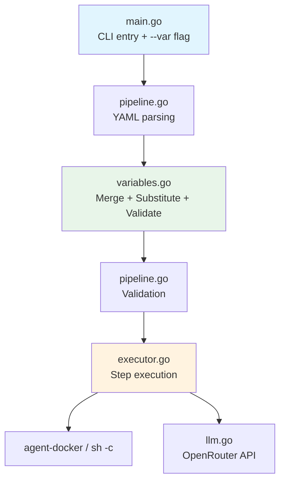
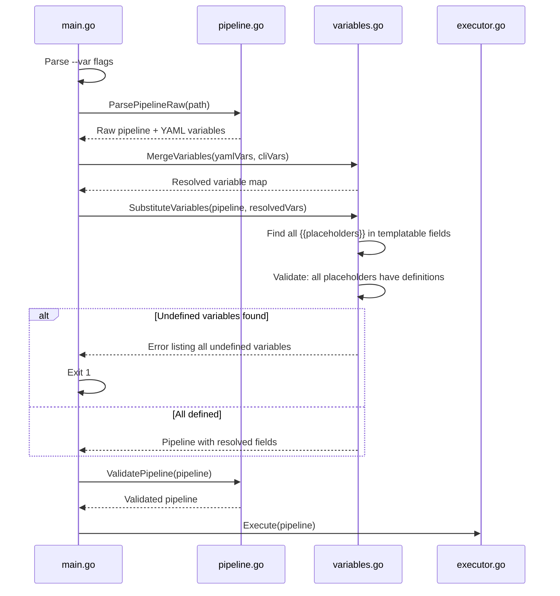

# Design Document: Pipeline Variables

## Overview

Pipeline Variables adds template variable support to the Agent Orchestrator. Users define a flat `variables` map in the pipeline YAML, reference values via `{{variable-name}}` placeholders in templatable fields, and optionally override them at runtime with `--var key=value` CLI flags. The orchestrator resolves all placeholders after YAML parsing and variable merging, but before pipeline validation and execution, failing fast if any placeholder references an undefined variable.

### Key Design Decisions

1. **New `variables.go` file** — all variable-related logic (parsing, merging, substitution, validation) lives in a single new file, keeping the orchestrator under the 8-file flat threshold (now 7 source files).
2. **Substitution before validation** — template resolution happens after YAML parsing and CLI merge but before `validatePipeline()`. This means validation sees fully resolved values, and undefined placeholders are caught before any execution.
3. **Simple string replacement** — no template engine dependency. `{{variable-name}}` is matched via a regex and replaced with `strings.ReplaceAll`. The double-brace syntax is unambiguous in YAML and doesn't conflict with any existing field content.
4. **Variables map on Pipeline struct** — the `Variables` field is added to the `rawPipeline` struct for YAML deserialization, then merged with CLI overrides and stored on the `Pipeline` struct for use during substitution.
5. **Fail-fast with all errors** — undefined variable validation collects all undefined references across all templatable fields and reports them all at once, rather than stopping at the first one.

## Architecture



### Resolution Flow



## Components and Interfaces

### File Layout (updated)

```
orchestrator/
├── main.go          # CLI entry point, --var flag parsing
├── config.go        # Environment loading, configuration struct
├── pipeline.go      # YAML parsing, validation, pipeline types
├── variables.go     # Variable merging, substitution, validation (NEW)
├── executor.go      # Step execution, loop handling, condition routing
├── llm.go           # OpenRouter API client
├── go.mod
└── go.sum
```

### main.go Changes

Add a repeatable `--var` flag using a custom `flag.Value` implementation:

```go
type varFlags []string

func (v *varFlags) String() string { return strings.Join(*v, ", ") }
func (v *varFlags) Set(val string) error {
    *v = append(*v, val)
    return nil
}

// In run():
var vars varFlags
fs.Var(&vars, "var", "Set variable key=value (repeatable)")
```

Parse `--var` values into a `map[string]string` after flag parsing. If any `--var` value doesn't contain `=`, exit with code 1 and a descriptive error to stderr.

Pass the parsed CLI variables to the pipeline loading flow.

### variables.go — New File

```go
// ParseCLIVars parses --var flag values into a map.
// Returns error if any value doesn't contain '='.
func ParseCLIVars(flags []string) (map[string]string, error)

// MergeVariables merges YAML-defined variables with CLI overrides.
// CLI values take precedence. Returns the resolved variable map.
func MergeVariables(yamlVars map[string]string, cliVars map[string]string) map[string]string

// SubstituteVariables replaces all {{variable-name}} placeholders in
// templatable fields with values from the resolved variable map.
// Returns an error listing all undefined variables found.
func SubstituteVariables(p *Pipeline, vars map[string]string) error

// FindPlaceholders returns all unique {{variable-name}} placeholder keys
// found in a string.
func FindPlaceholders(s string) []string

// ResolveString replaces all {{key}} placeholders in s with values from vars.
func ResolveString(s string, vars map[string]string) string
```

Templatable fields (applied to both top-level steps and loop steps):
- `Step.Prompt`
- `Step.Command`
- `Step.ProjectDir`
- `Condition.Prompt`
- `Condition.File`

Placeholder regex: `\{\{([a-z0-9-]+)\}\}`

### pipeline.go Changes

Add `Variables` field to `rawPipeline` for YAML deserialization:

```go
type rawPipeline struct {
    Variables map[string]string `yaml:"variables"`
    Steps     []PipelineElement `yaml:"steps"`
}
```

Split `ParsePipeline` into two phases:
1. `ParsePipelineRaw(path) (*Pipeline, map[string]string, error)` — parse YAML, extract variables, build pipeline struct (no validation yet)
2. `ValidatePipeline(p *Pipeline) error` — run all validation checks (existing `validatePipeline`, now exported)

This separation allows `main.go` to insert variable substitution between parsing and validation.

### executor.go Changes

Update `printDryRun()` to display the resolved variables section before printing steps. The resolved variables are stored on the `Executor` struct:

```go
type Executor struct {
    // ... existing fields ...
    ResolvedVars map[string]string  // for dry-run display
}
```

## Data Models

### Updated Pipeline YAML Schema

```yaml
# Optional variables section — flat string map
variables:
  project-path: "/home/user/myproject"
  spec-name: "agent-orchestrator"
  task-count: "5"

steps:
  - name: "create-code"
    agent: "claude"
    prompt: "Read specs from .kiro/specs/{{spec-name}} and implement in {{project-path}}"
    project_dir: "{{project-path}}"

  - name: "run-tests"
    command: "cd {{project-path}} && go test ./..."

  - loop:
      max_iterations: 3
      condition:
        prompt: "Are there still issues in {{spec-name}}?"
        file: "{{project-path}}/test-results.txt"
      steps:
        - name: "fix"
          agent: "claude"
          prompt: "Fix issues in {{project-path}}"
```

### Updated Go Types

```go
// Pipeline is the top-level structure parsed from the YAML file.
type Pipeline struct {
    Elements []PipelineElement
}

// rawPipeline is used for YAML deserialization.
type rawPipeline struct {
    Variables map[string]string `yaml:"variables"`
    Steps     []PipelineElement `yaml:"steps"`
}
```

No changes to `Step`, `Loop`, `Condition`, or `PipelineElement` structs — variable substitution modifies the string field values in-place before validation.

### CLI Flag Format

```
--var key=value
```

- Repeatable: `--var project-path=/tmp/proj --var spec-name=my-spec`
- Last occurrence wins for duplicate keys
- Key must match `[a-z0-9-]+` (same as placeholder syntax)
- Value is everything after the first `=` (can contain `=` characters)


## Correctness Properties

*A property is a characteristic or behavior that should hold true across all valid executions of a system — essentially, a formal statement about what the system should do. Properties serve as the bridge between human-readable specifications and machine-verifiable correctness guarantees.*

### Property 1: Variables YAML round trip

*For any* flat map of string key-value pairs (where keys match `[a-z0-9-]+`), serializing a pipeline with that `variables` map to YAML and parsing it back should produce the same variable map.

**Validates: Requirements 1.1, 1.2**

### Property 2: CLI variable parsing with last-wins semantics

*For any* list of valid `key=value` strings, parsing them into a variable map should produce a map where each key maps to the value from its last occurrence in the list. The value is everything after the first `=` character.

**Validates: Requirements 2.1, 2.5**

### Property 3: Variable merge — CLI takes precedence

*For any* two variable maps (YAML-defined and CLI-defined), merging them should produce a map containing all keys from both maps, where for any key present in both maps the CLI value is used, and for keys present in only one map that map's value is used.

**Validates: Requirements 2.2, 2.3**

### Property 4: Malformed --var flag rejection

*For any* string that does not contain an `=` character, parsing it as a `--var` flag should return an error.

**Validates: Requirements 2.4**

### Property 5: Template substitution correctness

*For any* pipeline containing `{{key}}` placeholders in any combination of templatable fields (step prompt, step command, step project_dir, condition prompt, condition file — in both top-level steps and loop steps), and a resolved variable map that defines all referenced keys, substitution should replace every placeholder with its corresponding value and preserve all surrounding text unchanged.

**Validates: Requirements 3.1, 3.2, 3.4, 3.5, 3.6, 6.1, 6.2**

### Property 6: Undefined variable detection reports all undefined keys

*For any* pipeline containing one or more `{{key}}` placeholders whose keys are not present in the resolved variable map, `SubstituteVariables` should return an error, and the error message should contain every undefined key name.

**Validates: Requirements 4.1, 4.2**

### Property 7: Dry-run shows resolved values, not placeholders

*For any* pipeline with variables and `{{key}}` placeholders in templatable fields, running in dry-run mode should produce output that contains the resolved variable values and does not contain any `{{key}}` placeholder syntax for defined variables.

**Validates: Requirements 5.1, 5.2**

## Error Handling

### Variable-Related Errors (fail fast, before validation)

| Error | Behavior |
|-------|----------|
| `--var` flag missing `=` separator | Exit 1, stderr: `error: invalid --var flag "value": must be in key=value format` |
| Undefined variable in templatable field | Exit 1, stderr: `error: undefined variables: var1, var2` (lists all undefined variables) |

### Design Principles

1. Variable errors are reported before pipeline validation — if a placeholder references an undefined variable, the user sees that error, not a downstream validation error on the resolved field.
2. All undefined variables across all templatable fields are collected and reported in a single error message.
3. Malformed `--var` flags are caught during CLI argument parsing, before any YAML is read.
4. Empty string values are valid — `--var key=` sets key to `""`.
5. Missing `variables` section in YAML is not an error — it's treated as an empty map.

## Testing Strategy

### Testing Framework

- **Unit/integration tests**: Go's built-in `testing` package
- **Property-based tests**: `pgregory.net/rapid` (already a dependency)

### Test File

```
orchestrator/
├── variables_test.go   # All variable-related tests (NEW)
```

### Unit Tests

Unit tests cover specific examples and edge cases:

- Parse a pipeline YAML with a `variables` section and verify the map is extracted
- Parse a pipeline YAML without a `variables` section and verify an empty map
- Parse `--var key=value` flags and verify the resulting map
- Parse `--var key=val=ue` (value contains `=`) and verify the value is `val=ue`
- Reject `--var` flag without `=`
- Merge YAML and CLI variables, verify CLI wins on conflicts
- Substitute a single placeholder in a prompt field
- Substitute multiple placeholders in one field
- Substitute placeholders in all templatable field types (prompt, command, project_dir, condition prompt, condition file)
- Substitute placeholders in loop step fields and loop condition fields
- Detect a single undefined variable and verify error message
- Detect multiple undefined variables across different fields and verify all are listed
- Empty string variable value resolves to empty string
- Dry-run output includes resolved variables section
- Dry-run output shows resolved field values, not placeholders
- Integration: pipeline with variable-based goto target passes validation after substitution

### Property-Based Tests

Each property test runs a minimum of 100 iterations using `rapid`. Each test is tagged with a comment referencing the design property.

| Test | Property | Description |
|------|----------|-------------|
| `TestVariablesYAMLRoundTrip` | Property 1 | Generate random valid variable maps, serialize to YAML with a pipeline, parse back, assert variable map equivalence |
| `TestCLIVarParsingLastWins` | Property 2 | Generate random lists of `key=value` strings with potential duplicates, parse, verify last value wins for each key |
| `TestVariableMergeCLIPrecedence` | Property 3 | Generate two random variable maps, merge, verify all keys present and CLI values take precedence |
| `TestMalformedVarFlagRejected` | Property 4 | Generate random strings without `=`, verify parsing returns error |
| `TestSubstitutionCorrectness` | Property 5 | Generate pipelines with random placeholders in all templatable fields and a complete variable map, substitute, verify all placeholders replaced and surrounding text preserved |
| `TestUndefinedVariableDetection` | Property 6 | Generate pipelines with placeholders referencing keys not in the variable map, verify error lists all undefined keys |
| `TestDryRunShowsResolvedValues` | Property 7 | Generate pipelines with variables, capture dry-run output, verify resolved values present and no unresolved `{{key}}` placeholders remain |

### Property Test Tags

Each property-based test includes a comment tag:
```go
// Feature: pipeline-variables, Property 1: Variables YAML round trip
// Feature: pipeline-variables, Property 2: CLI variable parsing with last-wins semantics
// Feature: pipeline-variables, Property 3: Variable merge — CLI takes precedence
// Feature: pipeline-variables, Property 4: Malformed --var flag rejection
// Feature: pipeline-variables, Property 5: Template substitution correctness
// Feature: pipeline-variables, Property 6: Undefined variable detection reports all undefined keys
// Feature: pipeline-variables, Property 7: Dry-run shows resolved values, not placeholders
```
