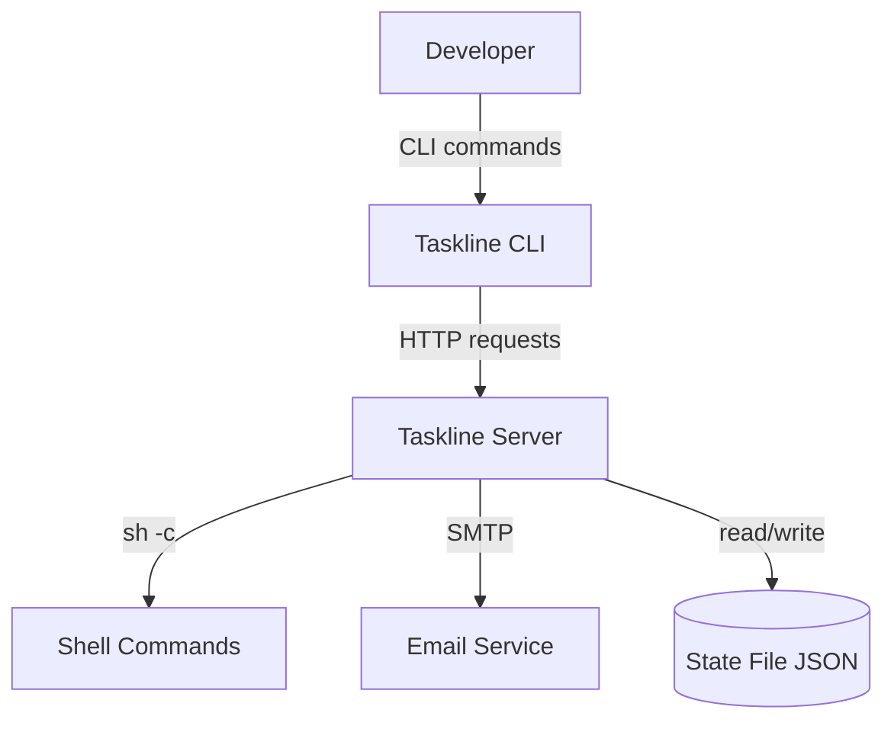
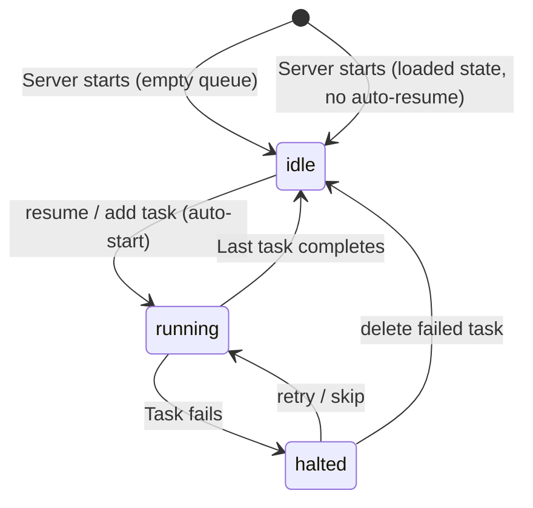
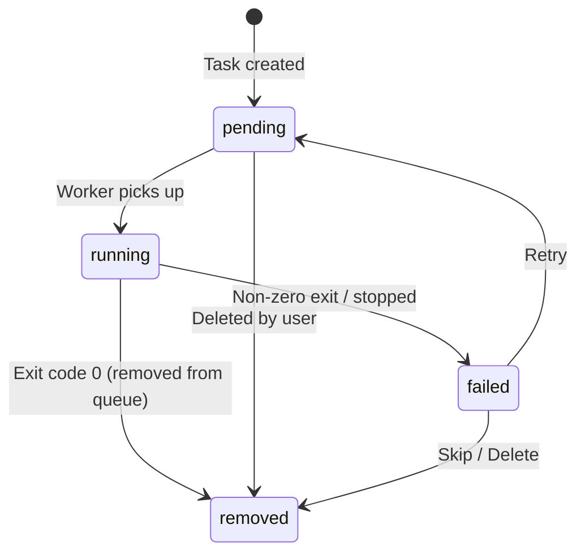

# Design Document: Taskline

## Overview

Taskline is a sequential command queue server consisting of two Go binaries — an HTTP server daemon and a CLI client. The server accepts shell commands via a REST API, queues them in FIFO order, and executes them one at a time using a worker goroutine. If a command fails (non-zero exit code), the queue halts and an email notification is sent. The queue state is persisted to a JSON file for crash recovery.

The system lives within the trayline monorepo as two separate Go modules:
- `taskline/server/` — HTTP daemon with worker goroutine
- `taskline/cli/` — Command-line client for queue management

Key design principles:
- **Simplicity** — Single-file state persistence (JSON), no database, in-process worker
- **Sequential guarantee** — Exactly one command runs at a time, strict FIFO ordering
- **Fail-fast** — Queue halts on first failure, requires explicit human intervention to continue
- **Crash recovery** — State file preserves queue across restarts, but execution never auto-resumes

## Architecture

### System Context



### Key Architectural Decisions

1. **Single worker goroutine** — The server runs one goroutine that pulls tasks from the queue and executes them sequentially. This guarantees ordering without complex locking or distributed coordination.

2. **JSON state file with atomic writes** — State is persisted by writing to a temp file and renaming. This prevents corruption on crash. No database dependency.

3. **No auto-resume on restart** — After loading state from disk, the queue stays in whatever state it was persisted in. If it was "running", it transitions to needing a manual `/queue/resume` call. This prevents accidental re-execution of commands after crashes.

4. **sh -c execution** — Commands are executed via `sh -c` to support shell features (pipes, redirects, chaining). Output goes directly to the server's stdout — the API only exposes metadata.

5. **Identifier resolution** — Tasks can be referenced by either Task_ID or Task_Name. Resolution checks ID first, then name (case-sensitive).

6. **Halt-on-failure with notification** — When a task fails, the queue halts and an email is sent. The developer must explicitly retry or skip the failed task to continue processing.

### Queue State Machine



### Task Status Transitions



## Components and Interfaces

### Server Project Structure

```
taskline/server/
├── main.go              # Entry point, signal handling, server startup
├── config.go            # Environment loading, validation
├── config_test.go       # Config tests
├── queue.go             # Queue data structure, state machine, task management
├── queue_test.go        # Queue logic tests
├── worker.go            # Worker goroutine, command execution
├── worker_test.go       # Worker tests
├── handler.go           # HTTP route registration and handlers
├── handler_test.go      # Handler tests
├── state.go             # JSON state persistence (atomic writes, load on startup)
├── state_test.go        # State persistence tests
├── notify.go            # Email notification service
├── notify_test.go       # Notification tests
├── names.go             # Docker-style random name generator
├── names_test.go        # Name generator tests
├── scripts/
│   ├── build.sh         # Compiles taskline-server to bin/
│   └── install.sh       # Builds and installs to ~/.local/bin/
├── .env.example         # Environment variable template
├── go.mod
└── go.sum
```

### CLI Project Structure

```
taskline/cli/
├── main.go              # Entry point, subcommand dispatch
├── config.go            # TASKLINE_URL resolution, validation
├── config_test.go       # Config tests
├── client.go            # HTTP client wrapper for server API
├── client_test.go       # Client tests
├── format.go            # Table formatting, color output, truncation
├── format_test.go       # Formatter tests
├── commands.go          # Subcommand implementations (add, list, delete, etc.)
├── commands_test.go     # Command tests
├── completions/
│   └── _taskline        # Zsh completion script
├── scripts/
│   ├── build.sh         # Compiles taskline to bin/
│   └── install.sh       # Builds, installs binary + completions
├── go.mod
└── go.sum
```

### Component Responsibilities

#### Config (`server/config.go`)
- Loads `.env` via `godotenv`
- Reads `APP_PORT`, `STATE_FILE`, `NOTIFY_EMAIL`, `SMTP_HOST`, `SMTP_PORT`, `SMTP_USER`, `SMTP_PASSWORD`, `SMTP_FROM`
- Validates port range (1–65535)
- Returns typed `Config` struct or exits with error on invalid values

#### Queue (`server/queue.go`)
- Thread-safe queue (protected by `sync.Mutex`)
- Manages task list and queue state (`idle`, `running`, `halted`)
- Task CRUD operations: add, remove, update, find by ID/name
- Position-based insertion for priority scheduling
- Ensures uniqueness of Task_ID and Task_Name

#### Worker (`server/worker.go`)
- Single goroutine consuming from the queue
- Executes commands via `exec.Command("sh", "-c", command)`
- Pipes stdout/stderr to server's stdout
- Handles process termination (SIGTERM → SIGKILL after 5s)
- Transitions task status and queue state on completion/failure
- Triggers state persistence and notifications on status changes

#### Handlers (`server/handler.go`)
- Registers routes on `net/http` ServeMux
- `POST /tasks` — Create task
- `GET /tasks` — List tasks
- `DELETE /tasks/{identifier}` — Delete task
- `PATCH /tasks/{identifier}` — Update task
- `POST /tasks/retry` — Retry failed task
- `POST /tasks/skip` — Skip failed task
- `POST /tasks/stop` — Stop running task
- `POST /queue/resume` — Resume queue
- `GET /queue/status` — Queue status

#### State (`server/state.go`)
- Serializes queue to JSON
- Atomic write (temp file + rename)
- Loads state on startup
- Handles corrupted files (rename with `.corrupted` suffix)

#### Notify (`server/notify.go`)
- Sends email via SMTP on task failure
- Configured through `SMTP_HOST`, `SMTP_PORT`, `SMTP_USER`, `SMTP_PASSWORD`, `SMTP_FROM` env vars
- `SMTP_FROM` defaults to `SMTP_USER` if not set
- Disabled if any of `SMTP_HOST`, `SMTP_PORT`, `SMTP_USER`, `SMTP_PASSWORD` is missing (same as missing `NOTIFY_EMAIL`)
- Skips if `NOTIFY_EMAIL` not configured
- Logs error if delivery fails, never retries

#### Names (`server/names.go`)
- Generates Docker-style random names (adjective-noun)
- Maintains used-names set to prevent reuse within session
- Validates user-provided names against rules

#### CLI Client (`cli/client.go`)
- HTTP client targeting `TASKLINE_URL`
- Methods for each API endpoint
- 10-second connection timeout
- Returns structured errors from response body

#### CLI Formatter (`cli/format.go`)
- Column-aligned table output (similar to `docker ps`)
- Truncation with ellipsis for long commands
- Colored STATUS column (green/yellow/red)
- Respects `NO_COLOR` and non-TTY detection
- Timestamp formatting to "YYYY-MM-DD HH:MM" local time

### External Dependencies

| Package | Purpose |
|---------|---------|
| `github.com/joho/godotenv` | `.env` file loading (consistent with monorepo) |
| `pgregory.net/rapid` | Property-based testing (consistent with monorepo) |
| `net/smtp` | Email notifications (stdlib) |

No external HTTP framework — using `net/http` stdlib (consistent with the server pattern in this monorepo for simple services). No external router needed since the route set is small.

### API Endpoints

| Method | Path | Description |
|--------|------|-------------|
| `POST` | `/tasks` | Create a new task |
| `GET` | `/tasks` | List all tasks in queue |
| `DELETE` | `/tasks/{identifier}` | Delete a task by ID or name |
| `PATCH` | `/tasks/{identifier}` | Update a pending task |
| `POST` | `/tasks/retry` | Retry the failed task |
| `POST` | `/tasks/skip` | Skip the failed task |
| `POST` | `/tasks/stop` | Stop the running task |
| `POST` | `/queue/resume` | Resume queue execution |
| `GET` | `/queue/status` | Get queue state and counts |

## Data Models

### Task

```go
type TaskStatus string

const (
    TaskPending TaskStatus = "pending"
    TaskRunning TaskStatus = "running"
    TaskFailed  TaskStatus = "failed"
)

type Task struct {
    ID        string     `json:"id"`         // 8-char lowercase alphanumeric
    Name      string     `json:"name"`       // Docker-style or user-provided
    Command   string     `json:"command"`    // Shell command to execute
    Status    TaskStatus `json:"status"`     // pending, running, failed
    ExitCode  *int       `json:"exit_code,omitempty"` // Set when failed
    CreatedAt time.Time  `json:"created_at"` // RFC 3339
}
```

### Queue State

```go
type QueueState string

const (
    QueueIdle    QueueState = "idle"
    QueueRunning QueueState = "running"
    QueueHalted  QueueState = "halted"
)

type Queue struct {
    mu     sync.Mutex
    State  QueueState `json:"state"`
    Tasks  []*Task    `json:"tasks"`
    usedIDs   map[string]bool // tracks used IDs within session
    usedNames map[string]bool // tracks used names within session
}
```

### State File Schema

```json
{
  "state": "halted",
  "tasks": [
    {
      "id": "a1b2c3d4",
      "name": "brave-tiger",
      "command": "npm run build",
      "status": "failed",
      "exit_code": 1,
      "created_at": "2025-01-15T10:30:00Z"
    },
    {
      "id": "e5f6g7h8",
      "name": "calm-river",
      "command": "npm run test",
      "status": "pending",
      "created_at": "2025-01-15T10:31:00Z"
    }
  ]
}
```

### Server Config

```go
type Config struct {
    Port         int    // APP_PORT, default 9090
    StateFile    string // STATE_FILE, default "./taskline-state.json"
    NotifyEmail  string // NOTIFY_EMAIL, optional
    SMTPHost     string // SMTP_HOST, required for notifications
    SMTPPort     string // SMTP_PORT, required for notifications
    SMTPUser     string // SMTP_USER, required for notifications
    SMTPPassword string // SMTP_PASSWORD, required for notifications
    SMTPFrom     string // SMTP_FROM, defaults to SMTP_USER
}
```

### CLI Config

```go
type Config struct {
    ServerURL string // TASKLINE_URL, default "http://localhost:9090"
}
```

### API Request/Response Types

```go
// POST /tasks request
type CreateTaskRequest struct {
    Command  string `json:"command"`
    Name     string `json:"name,omitempty"`
    Position *int   `json:"position,omitempty"`
}

// POST /tasks response (201)
type CreateTaskResponse struct {
    ID        string    `json:"id"`
    Name      string    `json:"name"`
    Command   string    `json:"command"`
    Status    string    `json:"status"`
    Position  int       `json:"position"`
    CreatedAt time.Time `json:"created_at"`
}

// GET /tasks response item
type TaskListItem struct {
    Position  int       `json:"position"`
    ID        string    `json:"id"`
    Name      string    `json:"name"`
    Command   string    `json:"command"`
    Status    string    `json:"status"`
    CreatedAt time.Time `json:"created_at"`
}

// PATCH /tasks/{identifier} request
type UpdateTaskRequest struct {
    Command string `json:"command,omitempty"`
    Name    string `json:"name,omitempty"`
}

// GET /queue/status response
type QueueStatusResponse struct {
    State        string      `json:"state"`
    PendingCount int         `json:"pendingCount"`
    CurrentTask  *TaskBrief  `json:"currentTask,omitempty"`
    FailedTask   *FailedInfo `json:"failedTask,omitempty"`
}

type TaskBrief struct {
    ID      string `json:"id"`
    Name    string `json:"name"`
    Command string `json:"command"`
}

type FailedInfo struct {
    ID       string `json:"id"`
    Name     string `json:"name"`
    Command  string `json:"command"`
    ExitCode int    `json:"exit_code"`
}

// Error response (all error cases)
type ErrorResponse struct {
    Error   string `json:"error"`
    Message string `json:"message"`
}
```


## Correctness Properties

*A property is a characteristic or behavior that should hold true across all valid executions of a system — essentially, a formal statement about what the system should do. Properties serve as the bridge between human-readable specifications and machine-verifiable correctness guarantees.*

### Property 1: Config port validation

*For any* string value set as the `APP_PORT` environment variable, if the value is a numeric integer in the range 1–65535, then `LoadConfig()` shall return a valid Config with that port. If the value is non-numeric, negative, zero, or exceeds 65535, then `LoadConfig()` shall return an error.

**Validates: Requirements 1.1, 1.3**

### Property 2: Task creation produces valid structure

*For any* non-empty, non-whitespace-only command string submitted to the queue, the resulting Task shall have a Task_ID matching the pattern `[a-z0-9]{8}`, status "pending", a CreatedAt timestamp not before the submission time, and the original command stored verbatim.

**Validates: Requirements 2.1, 15.1**

### Property 3: Position insertion correctness

*For any* queue with N pending tasks and a position value P, if P is a non-negative integer ≤ N, the new task shall be inserted at index P among pending tasks. If P > N, the task shall be appended at the end. If P is negative, a float, or a non-integer string, the request shall be rejected with HTTP 400.

**Validates: Requirements 2.2, 2.3, 2.4**

### Property 4: Command validation rejects empty and whitespace

*For any* string composed entirely of whitespace characters (spaces, tabs, newlines, or empty string), submitting it as the `command` field shall be rejected with HTTP 400. For any string containing at least one non-whitespace character, the command shall be accepted.

**Validates: Requirements 2.7**

### Property 5: Name generation format

*For any* auto-generated Task_Name, it shall match the pattern `[a-z]+-[a-z]+` (a lowercase adjective, a hyphen, and a lowercase noun). The adjective and noun components shall each be at least 2 characters long.

**Validates: Requirements 2.6, 15.2**

### Property 6: Name uniqueness invariant

*For any* sequence of task additions and removals within a single server session, no two tasks in the queue shall ever share the same Task_ID or Task_Name, and no auto-generated Task_ID or Task_Name shall be reused after a task has been removed from the queue.

**Validates: Requirements 2.10, 9.7, 15.3, 15.5**

### Property 7: Name validation rules

*For any* user-provided Task_Name, if the name exceeds 64 characters, contains characters other than lowercase letters (`a-z`), digits (`0-9`), or hyphens (`-`), or does not start with a lowercase letter, the request shall be rejected with HTTP 400. If the name satisfies all constraints, it shall be accepted.

**Validates: Requirements 15.6**

### Property 8: Failure halts queue

*For any* task whose command exits with a non-zero exit code, the task's status shall transition to "failed" and the queue state shall transition to "halted". While the queue is in "halted" state, no pending task shall transition to "running".

**Validates: Requirements 4.1, 4.2**

### Property 9: Retry resets failed task

*For any* queue in "halted" state with a failed task and zero or more pending tasks, invoking retry shall reset the failed task's status to "pending", place it at position 0 among pending tasks, and transition the queue state to "running".

**Validates: Requirements 6.1**

### Property 10: Skip removes failed task

*For any* queue in "halted" state with a failed task, invoking skip shall remove the failed task from the queue and transition the queue state to "running".

**Validates: Requirements 6.3**

### Property 11: Task list ordering

*For any* queue containing tasks, the list response shall order tasks by queue position: the running task (if any) at index 0, followed by pending tasks in execution order, followed by the failed task (if any) at the last index.

**Validates: Requirements 7.4**

### Property 12: Queue status response structure

*For any* queue state, the status response shall include `state` (one of "idle", "running", "halted") and `pendingCount` (non-negative integer). If state is "running", a `currentTask` object with ID, name, and command shall be present. If state is "halted", a `failedTask` object with ID, name, command, and exit_code shall be present. If state is "idle", neither object shall be present and pendingCount shall be 0.

**Validates: Requirements 10.1, 10.2, 10.3, 10.4, 10.5**

### Property 13: State persistence round-trip

*For any* valid queue state (containing any combination of tasks with valid statuses, IDs, names, commands, and timestamps, plus a valid queue state), serializing to JSON and deserializing back shall produce an identical queue state — same tasks with same fields in the same order, same queue state value.

**Validates: Requirements 11.1, 11.6**

### Property 14: Identifier resolution order

*For any* task in the queue, resolving by its Task_ID shall always find it. For any identifier string, the system shall first attempt case-sensitive match against Task_ID, and only if no match is found, attempt case-sensitive match against Task_Name. If a Task_ID happens to equal another task's Task_Name, the ID match shall take precedence.

**Validates: Requirements 15.4**

### Property 15: Command truncation

*For any* string, if its display length exceeds 40 characters, the truncated output shall be exactly 40 characters with the last character being "…" (ellipsis). If its display length is ≤ 40 characters, the output shall equal the original string unchanged.

**Validates: Requirements 14.2**

### Property 16: Timestamp formatting

*For any* valid RFC 3339 timestamp, the CLI formatter shall produce a string matching the pattern `YYYY-MM-DD HH:MM` (using the local timezone), where YYYY is a 4-digit year, MM is a 2-digit month, DD is a 2-digit day, HH is a 2-digit hour (00–23), and MM is a 2-digit minute.

**Validates: Requirements 14.7**

### Property 17: URL scheme validation

*For any* string set as `TASKLINE_URL`, if it does not start with `http://` or `https://`, the CLI shall reject it with an error. If it starts with either valid scheme prefix, it shall be accepted as the server URL.

**Validates: Requirements 13.3**

### Property 18: Task update applies fields correctly

*For any* pending task and a valid update request containing a non-empty `command` and/or non-empty `name`, after the update, the task's fields shall reflect the new values for provided fields and retain original values for omitted fields. The task's ID, status, and creation timestamp shall remain unchanged.

**Validates: Requirements 9.1, 9.2, 9.3**


## Error Handling

### Strategy

The server uses a layered error handling approach:

1. **Input validation errors** — Caught at the handler boundary. Return HTTP 400 with structured JSON error. Invalid JSON bodies, missing/empty fields, invalid position values, and invalid task names are all caught here.

2. **Precondition errors** — Business logic constraints. Return HTTP 409 (Conflict) when an operation cannot be performed in the current state (e.g., deleting a running task, retrying when no task has failed, resuming an already-running queue).

3. **Not found errors** — Return HTTP 404 when a task identifier doesn't match any task in the queue.

4. **State persistence errors** — Logged at error level. Server continues operating with in-memory state. Retry on next state change. Never blocks API responses.

5. **Notification errors** — Logged at error level. Never retried. Queue state is unaffected by notification failures.

6. **Command execution errors** — If `sh -c` fails to spawn (permission denied, resource exhaustion), the task transitions to "failed" and the queue halts. Same behavior as a non-zero exit code.

### Error Response Format

All API error responses use a consistent JSON structure:

```json
{
  "error": "VALIDATION_ERROR",
  "message": "Human-readable description of what went wrong"
}
```

Error codes:

| Code | HTTP Status | Usage |
|------|-------------|-------|
| `VALIDATION_ERROR` | 400 | Invalid JSON, missing fields, invalid values |
| `NOT_FOUND` | 404 | Task identifier not found in queue |
| `CONFLICT` | 409 | Operation not allowed in current state |

### Signal Handling (Server)

1. Receive SIGTERM or SIGINT
2. Stop accepting new HTTP connections
3. If a task is running: wait up to 30s for completion
4. If task doesn't finish in 30s: send SIGKILL to command process, mark task as failed
5. Persist queue state to State_File
6. Exit with code 0

### CLI Error Handling

- HTTP 4xx/5xx responses → parse error JSON, print `message` to stderr, exit 1
- Connection refused / timeout → print descriptive error with attempted URL to stderr, exit 1
- Invalid CLI arguments → print usage hint to stderr, exit 2


## Testing Strategy

### Property-Based Testing

The project uses `pgregory.net/rapid` (consistent with the monorepo) for property-based testing. Each property test runs a minimum of 100 iterations.

**Library:** `pgregory.net/rapid`

**Properties to implement:**

| Property | Test File | Tag |
|----------|-----------|-----|
| Property 1: Config port validation | `server/config_test.go` | Feature: taskline, Property 1: Config port validation |
| Property 2: Task creation structure | `server/queue_test.go` | Feature: taskline, Property 2: Task creation produces valid structure |
| Property 3: Position insertion | `server/queue_test.go` | Feature: taskline, Property 3: Position insertion correctness |
| Property 4: Command validation | `server/handler_test.go` | Feature: taskline, Property 4: Command validation rejects empty and whitespace |
| Property 5: Name generation format | `server/names_test.go` | Feature: taskline, Property 5: Name generation format |
| Property 6: Name uniqueness | `server/queue_test.go` | Feature: taskline, Property 6: Name uniqueness invariant |
| Property 7: Name validation | `server/names_test.go` | Feature: taskline, Property 7: Name validation rules |
| Property 8: Failure halts queue | `server/queue_test.go` | Feature: taskline, Property 8: Failure halts queue |
| Property 9: Retry resets failed | `server/queue_test.go` | Feature: taskline, Property 9: Retry resets failed task |
| Property 10: Skip removes failed | `server/queue_test.go` | Feature: taskline, Property 10: Skip removes failed task |
| Property 11: Task list ordering | `server/queue_test.go` | Feature: taskline, Property 11: Task list ordering |
| Property 12: Queue status structure | `server/handler_test.go` | Feature: taskline, Property 12: Queue status response structure |
| Property 13: State round-trip | `server/state_test.go` | Feature: taskline, Property 13: State persistence round-trip |
| Property 14: Identifier resolution | `server/queue_test.go` | Feature: taskline, Property 14: Identifier resolution order |
| Property 15: Command truncation | `cli/format_test.go` | Feature: taskline, Property 15: Command truncation |
| Property 16: Timestamp formatting | `cli/format_test.go` | Feature: taskline, Property 16: Timestamp formatting |
| Property 17: URL scheme validation | `cli/config_test.go` | Feature: taskline, Property 17: URL scheme validation |
| Property 18: Task update fields | `server/queue_test.go` | Feature: taskline, Property 18: Task update applies fields correctly |

Each property test is a single `rapid.Check` call with minimum 100 iterations.

### Unit Tests (Example-Based)

Focus areas for example-based tests:
- Default config values (port 9090, state file path, URL default)
- Specific HTTP status codes for precondition failures (409 for running task deletion, 404 for missing tasks)
- Malformed JSON rejection (400)
- Empty queue list returns `[]`
- CLI argument validation (missing command for `add`, missing flags for `update`)
- Color codes for each status value
- Resume edge cases (already running, empty queue, halted)

### Integration Tests

Focus areas:
- Full task lifecycle: add → queue starts → command runs → completes → removed
- Failure lifecycle: add → fails → halted → retry → runs again
- Stop lifecycle: add → running → stop → halted
- Signal handling: SIGTERM with running task, SIGTERM while idle
- State persistence: add tasks → restart server → verify loaded state
- CLI end-to-end: CLI → server → verify output formatting

### Test Mocking Strategy

- **Command execution** — Interface-based mock (`CommandRunner` interface) for unit tests
- **Email notifications** — Interface-based mock (`Notifier` interface) for unit tests
- **File I/O** — Interface-based mock for state persistence tests
- **Time** — Inject `clock` interface for timestamp tests
- **HTTP server** — `httptest.Server` for CLI client tests

### Test Commands

```bash
# Server tests
cd taskline/server
go test ./... -v              # all tests
go test ./... -run Property   # property tests only
go test -count=1 -race ./... # with race detector

# CLI tests
cd taskline/cli
go test ./... -v              # all tests
go test ./... -run Property   # property tests only
```
