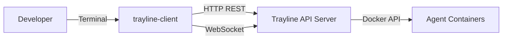
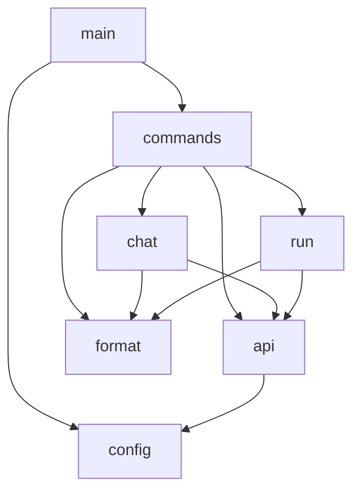

# Design Document: Terminal Client

## Overview

The Terminal Client (`trayline-client`) is a Go CLI tool that provides interactive and non-interactive access to the Trayline Agent API Server. It connects via HTTP REST for one-shot tasks and task/session management, and via WebSocket for interactive chat sessions with streaming output.

The client is a standalone binary that lives in the `client/` directory at the project root, following the same patterns as the existing `orchestrator/` and `server/` modules. It uses `gorilla/websocket` for WebSocket connections (consistent with the server), `joho/godotenv` for `.env` loading, and `pgregory.net/rapid` for property-based testing.

Two operational modes:
- **Interactive Chat (WebSocket)** — Open a session with an agent, exchange messages with real-time streaming output. Supports reconnection to existing sessions.
- **One-Shot Task (REST)** — Submit a prompt via `POST /run`, wait for completion via long-poll or polling, display results.

Supporting commands provide task/session listing, cancellation, termination, and health checks.

## Architecture

### System Context



### Key Architectural Decisions

1. **Single binary, subcommand pattern** — The client uses a subcommand structure (`chat`, `run`, `health`, `tasks`, `task`, `cancel`, `sessions`, `terminate`) with Go's `flag` package for argument parsing. No external CLI framework needed for this scope.

2. **Separation of concerns** — The client is structured into layers: CLI parsing → command handlers → API client → output formatting. Each layer has a clear interface allowing independent testing.

3. **Output stream separation** — All data output goes to stdout (task results, chat output). All metadata, prompts, progress indicators, and errors go to stderr. This supports piping: `trayline-client run --agent claude --prompt "..." > result.txt`.

4. **Signal-aware readline** — During chat sessions, the client intercepts SIGINT to send interrupt messages to the agent (first press) or exit (second press). Outside chat, SIGINT triggers immediate graceful shutdown.

5. **Stateless client** — No local persistence beyond config resolution. All state lives on the server. The client is a thin presentation layer over the API.

6. **gorilla/websocket** — Same library as the server, ensuring protocol compatibility and consistent behavior.

## Components and Interfaces

### Project Structure

```
client/
├── main.go              # Entry point, subcommand dispatch, signal setup
├── config.go            # Configuration resolution (flags, env, .env, defaults)
├── config_test.go       # Config resolution property tests
├── commands.go          # Subcommand definitions and help text
├── chat.go             # Interactive chat session handler (WebSocket)
├── chat_test.go        # Chat command tests
├── run.go              # One-shot task execution handler
├── run_test.go         # Run command tests
├── api.go              # HTTP/WS client wrapper (requests, auth, error handling)
├── api_test.go         # API client tests
├── format.go           # Output formatting (color, tables, truncation)
├── format_test.go      # Formatter property tests
├── go.mod
├── go.sum
├── .env.example         # Environment variable template
├── bin/                 # Build output directory
├── scripts/
│   ├── build.sh         # Compiles binary to bin/
│   └── install.sh       # Builds, installs binary and zsh completion
└── completions/
    └── _trayline-client  # Zsh completion script
```

### Component Responsibilities

#### Config (`config.go`)
- Resolves server URL: `--server` flag → `TRAYLINE_SERVER_URL` env → `.env` file → default `http://localhost:8080`
- Resolves token: `--token` flag → `TRAYLINE_API_TOKEN` env → `.env` file → error
- Validates URL scheme (must start with `http://` or `https://`)
- Strips trailing slash from server URL
- Loads `.env` file silently (no error if missing)
- Returns typed `Config` struct or error with exit code 2

#### Commands (`commands.go`)
- Defines all subcommands, their flags, and usage text
- Dispatches to the appropriate handler function
- Handles `--help`, `--version`, unknown subcommands
- Validates mutually exclusive flags (`--quiet` + `--verbose`)

#### Chat Handler (`chat.go`)
- Establishes WebSocket connection to `/chat` or `/chat/{id}` (reconnect)
- Adds Bearer token to WebSocket upgrade request headers
- Reads server messages and dispatches to output formatter
- Reads user input line-by-line, sends as `{"type": "message"}`
- Handles `/quit` command → sends `{"type": "terminate"}`
- Manages signal state (first SIGINT → interrupt, second → exit)
- Handles connection timeout (10s dial timeout)

#### Run Handler (`run.go`)
- Sends `POST /run` with prompt, agent, optional model/system/format
- Handles HTTP 200 (immediate result) → display result
- Handles HTTP 202 (accepted, still running) → poll `GET /run/{id}` every 2s
- Enforces 10-minute polling timeout
- Displays task status, elapsed time on completion
- Handles `valid: false` warning for JSON format

#### API Client (`api.go`)
- Wraps `net/http` client with auth header injection
- Provides methods: `Health()`, `PostRun()`, `GetRun()`, `GetRuns()`, `CancelRun()`, `GetSessions()`, `TerminateSession()`
- Provides `DialWebSocket()` for WebSocket connections
- Handles timeout configuration (5s for health, 30s for general requests)
- Returns structured errors with HTTP status context

#### Output Formatter (`format.go`)
- Color support with TTY detection and `NO_COLOR` env var check
- Table formatting with column alignment and truncation (36 char max per column)
- Prompt prefix rendering (`> `) on stderr
- Timestamp formatting (`YYYY-MM-DD HH:MM`)
- Color scheme: green=success, red=error, yellow=warning, cyan=info

### Dependency Graph



### External Dependencies

| Package | Purpose |
|---------|---------|
| `github.com/gorilla/websocket` | WebSocket connections (consistent with server) |
| `github.com/joho/godotenv` | `.env` file loading (consistent with project) |
| `pgregory.net/rapid` | Property-based testing (consistent with project) |

No additional dependencies needed. The standard library provides everything else: `net/http`, `os/signal`, `flag`, `encoding/json`, `fmt`, `time`, `bufio`, `os`.

## Data Models

### Configuration

```go
type Config struct {
    ServerURL string // Resolved, validated, trailing slash stripped
    Token     string // Bearer token for API auth
    Verbose   bool   // Show request/response details on stderr
    Quiet     bool   // Suppress informational messages
}
```

### API Request/Response Types (client-side mirrors)

```go
// RunRequest mirrors the server's POST /run body
type RunRequest struct {
    Prompt       string `json:"prompt"`
    Agent        string `json:"agent"`
    Model        string `json:"model,omitempty"`
    System       string `json:"system,omitempty"`
    OutputFormat string `json:"output_format,omitempty"`
}

// RunResponse mirrors a completed task response
type RunResponse struct {
    ID          string     `json:"id"`
    Status      string     `json:"status"`
    Agent       string     `json:"agent"`
    Result      string     `json:"result,omitempty"`
    Error       string     `json:"error,omitempty"`
    Valid       *bool      `json:"valid,omitempty"`
    CreatedAt   time.Time  `json:"created_at"`
    CompletedAt *time.Time `json:"completed_at,omitempty"`
}

// RunAcceptedResponse mirrors a 202 response
type RunAcceptedResponse struct {
    ID     string `json:"id"`
    Status string `json:"status"`
}

// TaskSummary mirrors one item from GET /runs
type TaskSummary struct {
    ID        string    `json:"id"`
    Status    string    `json:"status"`
    Agent     string    `json:"agent"`
    CreatedAt time.Time `json:"created_at"`
}

// SessionSummary mirrors one item from GET /sessions
type SessionSummary struct {
    SessionID     string    `json:"session_id"`
    Agent         string    `json:"agent"`
    Model         string    `json:"model,omitempty"`
    CreatedAt     time.Time `json:"created_at"`
    LastMessageAt time.Time `json:"last_message_at"`
}

// ErrorResponse mirrors the server error format
type ErrorResponse struct {
    Error   string `json:"error"`
    Message string `json:"message"`
}
```

### WebSocket Message Types (client-side)

```go
// WSClientMessage sent to server
type WSClientMessage struct {
    Type   string `json:"type"`             // "message", "interrupt", "terminate"
    Prompt string `json:"prompt,omitempty"`
}

// WSServerMessage received from server
type WSServerMessage struct {
    Type      string `json:"type"`             // "session_started", "session_resumed", "output", "done", "error", "terminated", "context_compacted"
    SessionID string `json:"sessionId,omitempty"`
    Data      string `json:"data,omitempty"`
    Message   string `json:"message,omitempty"`
}
```

### CLI Subcommand Structure

| Command | Required Flags | Optional Flags | Description |
|---------|---------------|----------------|-------------|
| `health` | — | — | Check server connectivity |
| `chat` | `--agent` | `--model`, `--system`, `--session` | Start or reconnect chat session |
| `run` | `--agent`, `--prompt` | `--model`, `--system`, `--format` | Execute one-shot task |
| `tasks` | — | — | List all tasks |
| `task <id>` | — | — | Show task details |
| `cancel <id>` | — | — | Cancel a running task |
| `sessions` | — | — | List active sessions |
| `terminate <id>` | — | — | Terminate a session |

Global flags: `--server`, `--token`, `--quiet`, `--verbose`, `--help`, `--version`


## Correctness Properties

*A property is a characteristic or behavior that should hold true across all valid executions of a system — essentially, a formal statement about what the system should do. Properties serve as the bridge between human-readable specifications and machine-verifiable correctness guarantees.*

### Property 1: Configuration resolution follows priority chain

*For any* combination of configuration sources (flag value, environment variable, .env file value, or absent), the resolved server URL and token SHALL always equal the value from the highest-priority source that is present. Priority order: flag > environment variable > .env file > default (for URL only). If no token source is present, resolution SHALL return an error.

**Validates: Requirements 1.1, 1.2, 1.3, 1.5**

### Property 2: URL validation and normalization

*For any* string provided as a server URL, the config resolver SHALL accept it only if it starts with `http://` or `https://` (rejecting all other schemes or missing schemes with an error), and SHALL strip all trailing slashes from the accepted URL so the resolved URL never ends with `/`.

**Validates: Requirements 1.4, 1.6**

### Property 3: WebSocket URL construction includes provided parameters

*For any* combination of agent, model, and system values, the constructed WebSocket URL SHALL always include the agent as a query parameter, and SHALL include model and system as query parameters if and only if they are non-empty. All parameter values SHALL be properly URL-encoded.

**Validates: Requirements 3.1, 3.2, 3.3**

### Property 4: Empty input lines are filtered

*For any* input string composed entirely of whitespace characters (spaces, tabs, newlines), the chat input handler SHALL discard it without sending a WebSocket message. For any input string containing at least one non-whitespace character, the handler SHALL send it as a message.

**Validates: Requirements 3.5**

### Property 5: Table formatter produces aligned columns with all fields

*For any* non-empty list of table rows (tasks or sessions), the formatted output SHALL have every column's values starting at the same character position across all rows, and every row SHALL contain all specified fields (ID, status, agent, timestamp for tasks; session ID, agent, model, created, last message for sessions).

**Validates: Requirements 6.1, 7.1, 8.4**

### Property 6: Color output is disabled when NO_COLOR is set or output is non-TTY

*For any* message output, if the `NO_COLOR` environment variable is set (to any value including empty string) OR if stdout/stderr is not a TTY, the output SHALL contain no ANSI escape sequences. When colors are enabled (TTY and NO_COLOR unset), each message type SHALL use its designated color code (green for success, red for error, yellow for warning, cyan for info).

**Validates: Requirements 8.1, 8.2, 8.3**

### Property 7: Column value truncation at 36 characters

*For any* string value in a table column, if the string length exceeds 36 characters, the formatted value SHALL be exactly 36 characters long with the last character being an ellipsis (`…`). If the string length is 36 characters or fewer, the value SHALL appear unmodified (padded for alignment but not truncated).

**Validates: Requirements 8.6**

## Error Handling

### Strategy

The client uses a consistent error handling approach across all commands:

1. **Configuration errors** — Detected during startup before any network calls. Print descriptive message to stderr, exit with code 2. Examples: missing token, invalid URL scheme, mutually exclusive flags.

2. **Network errors** — Connection refused, DNS failure, timeouts. Print user-friendly message to stderr identifying the failure reason, exit with code 1. Never show raw Go error strings; wrap with context.

3. **HTTP errors** — Non-success status codes from the server. Parse the server's structured error response and display the `message` field. For unexpected status codes, show the status code and any available body text. Exit with code 1.

4. **WebSocket errors** — Unexpected close, read/write failures. Display disconnection message to stderr and exit with code 1. During graceful operations (user-initiated quit), close cleanly with code 0.

5. **User input errors** — Unknown subcommands, missing required flags, invalid flag values. Print specific error identifying the problem, suggest `--help`, exit with code 2.

### Exit Code Summary

| Code | Meaning |
|------|---------|
| 0 | Success |
| 1 | Runtime error (network failure, server error, task failed) |
| 2 | Usage error (invalid arguments, missing config) |
| 130 | Interrupted by SIGINT |

### Error Message Format

All error messages follow the pattern:
```
Error: <what went wrong>. <how to fix or what to check>.
```

Examples:
```
Error: Server unreachable at http://localhost:8080. Check that the server is running.
Error: Authentication token not configured. Set TRAYLINE_API_TOKEN or use --token flag.
Error: Invalid server URL scheme "ftp://...". URL must start with http:// or https://.
Error: Session abc123 not found or is no longer active.
```

## Testing Strategy

### Property-Based Testing

The project uses `pgregory.net/rapid` (consistent with the server and orchestrator) for property-based testing. Each property test runs a minimum of 100 iterations.

**Library:** `pgregory.net/rapid`

**Properties to implement:**

| Property | Test File | Tag |
|----------|-----------|-----|
| Property 1: Config resolution priority | `config_test.go` | Feature: terminal-client, Property 1: Configuration resolution follows priority chain |
| Property 2: URL validation and normalization | `config_test.go` | Feature: terminal-client, Property 2: URL validation and normalization |
| Property 3: WebSocket URL construction | `chat_test.go` | Feature: terminal-client, Property 3: WebSocket URL construction includes provided parameters |
| Property 4: Empty input filtering | `chat_test.go` | Feature: terminal-client, Property 4: Empty input lines are filtered |
| Property 5: Table formatting | `format_test.go` | Feature: terminal-client, Property 5: Table formatter produces aligned columns |
| Property 6: Color output control | `format_test.go` | Feature: terminal-client, Property 6: Color output disabled when NO_COLOR set or non-TTY |
| Property 7: Column truncation | `format_test.go` | Feature: terminal-client, Property 7: Column value truncation at 36 characters |

Each property test is a single `rapid.Check` call with minimum 100 iterations.

### Unit Tests (Example-Based)

Focus areas:
- Health check command (success, timeout, non-200 responses)
- Chat session lifecycle (session_started, output, done, error, terminated messages)
- Reconnection (session_resumed, 404, 409 responses)
- Run command (200 immediate, 202 polling, failed, cancelled)
- Task/session management commands (list, detail, cancel, terminate)
- Help and version output content
- Verbose output format
- Quiet mode suppression
- Signal handling state transitions (first SIGINT → interrupt, second → exit)

### Integration Tests

Focus areas:
- Full chat session flow: connect → send message → receive output → done → quit
- Run with polling: submit → 202 → poll → completed
- Reconnection flow: connect → disconnect → reconnect → resume
- Signal delivery during active WebSocket session
- Graceful shutdown with SIGTERM during chat

### Test Mocking Strategy

- **HTTP server** — `net/http/httptest.Server` for REST endpoint tests
- **WebSocket server** — `httptest.Server` with `gorilla/websocket` upgrader for chat tests
- **Environment variables** — `t.Setenv()` for config resolution tests
- **TTY detection** — Inject `isTerminal` function for color output tests
- **stdin** — `io.Reader` mock for user input simulation
- **Signals** — `os.Process.Signal()` for signal handling tests

### Test Commands

```bash
cd client
go test ./... -v              # all tests
go test ./... -run Property   # property tests only
go test -count=1 -race ./... # with race detector
```
