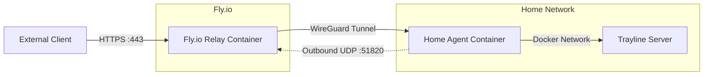
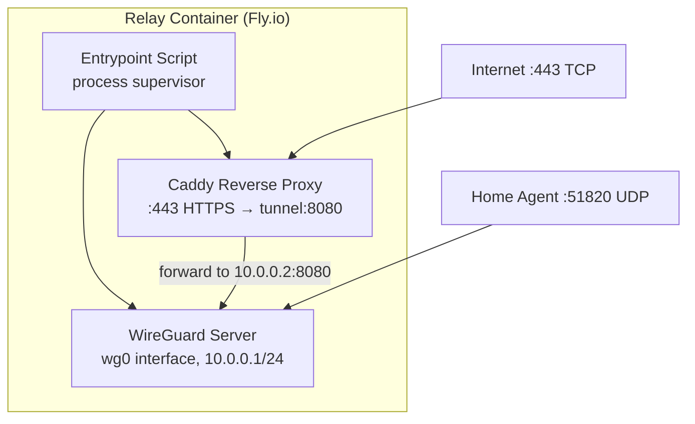
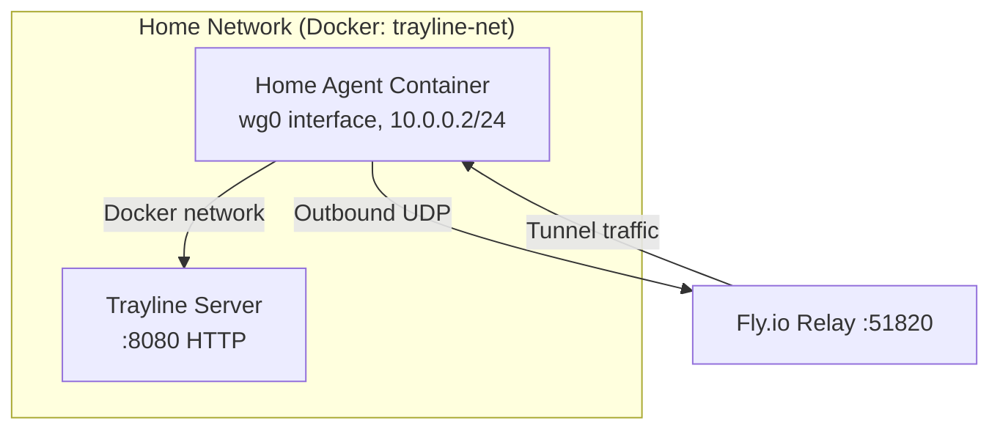
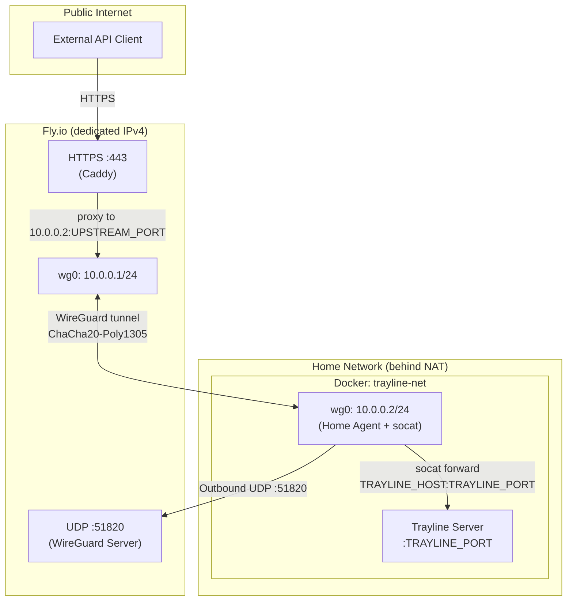
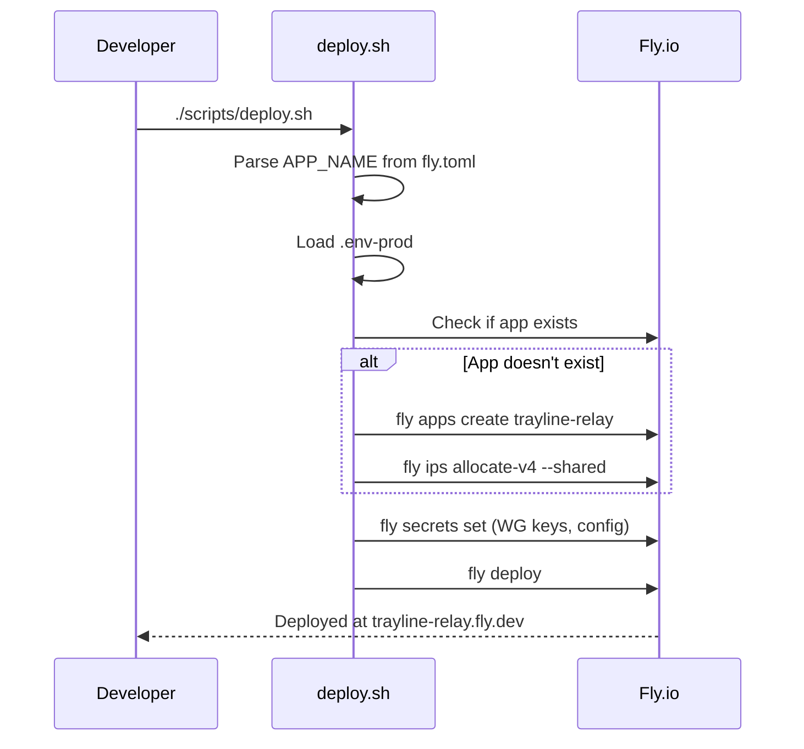

# Design Document: VPN Tunnel Proxy

## Overview

The VPN Tunnel Proxy provides secure remote access to the Trayline API server running on a home computer, without requiring port forwarding on the home router. It uses a two-component architecture:

1. **Relay Container** — A lightweight Docker container deployed on Fly.io running WireGuard (server mode) + Caddy (reverse proxy). It accepts external HTTPS requests and forwards them through the WireGuard tunnel.
2. **Home Agent** — A Docker container running on the home server alongside the existing Trayline server. It runs WireGuard in client mode, establishing an outbound connection to the Relay Container.

The design leverages WireGuard's simplicity (single UDP port, minimal config) and Caddy's automatic TLS to create a zero-maintenance tunnel that "just works" once configured.

**Traffic flow:** External Client → Fly.io (HTTPS:443) → Caddy → WireGuard tunnel → Home Agent → Trayline API (HTTP:8080)

## Architecture

### System Context



### Container Architecture — Relay (Fly.io)



### Container Architecture — Home Agent



### Key Architectural Decisions

1. **Single container with supervisor (Relay)** — WireGuard and Caddy run in the same container on Fly.io using a shell script supervisor. This avoids multi-container complexity on Fly.io (which doesn't support sidecar patterns easily) and keeps the architecture simple.

2. **Outbound-only connection (Home Agent)** — The home agent initiates the WireGuard connection outbound. No port forwarding is needed on the home router. WireGuard's keepalive packets maintain the NAT mapping.

3. **Caddy for TLS termination** — Caddy handles automatic HTTPS certificate provisioning via Let's Encrypt on Fly.io. It reverse-proxies to the WireGuard peer's tunnel IP, supporting both HTTP and WebSocket traffic.

4. **Static tunnel IPs** — The WireGuard tunnel uses a fixed private subnet (default 10.0.0.0/24) with static IPs: 10.0.0.1 for relay, 10.0.0.2 for home agent. This simplifies Caddy's upstream configuration.

5. **Dedicated IPv4 on Fly.io** — WireGuard requires UDP, and Fly.io requires a dedicated IPv4 address for UDP services. The deploy script allocates this automatically.

6. **Separate project directory** — The relay and home agent live in a new `tunnel/` directory at the project root, keeping the VPN infrastructure isolated from the server code.

7. **Environment-based configuration** — All WireGuard keys, IPs, and ports are configured via `.env` files, following the project's existing patterns. No secrets in committed files.

## Components and Interfaces

### Project Structure

```
tunnel/
├── relay/
│   ├── Dockerfile              # Alpine + WireGuard + Caddy
│   ├── Caddyfile               # Reverse proxy config (templated)
│   ├── entrypoint.sh           # Process supervisor: WG init → Caddy start
│   ├── health.sh               # Health check script for /health endpoint
│   ├── fly.toml                # Fly.io deployment config
│   ├── .env.example            # Relay environment template
│   ├── .env                    # Actual relay secrets (gitignored)
│   ├── .env-prod               # Production secrets (gitignored)
│   ├── .dockerignore           # Build context exclusions
│   └── scripts/
│       ├── build.sh            # Build Docker image
│       ├── start-docker.sh     # Run relay locally for testing
│       ├── stop-docker.sh      # Stop and remove local relay container
│       └── deploy.sh           # Deploy to Fly.io
├── home-agent/
│   ├── Dockerfile              # Alpine + WireGuard
│   ├── entrypoint.sh           # WG client init + health monitor
│   ├── .env.example            # Home agent environment template
│   ├── .env                    # Actual home agent secrets (gitignored)
│   ├── .dockerignore           # Build context exclusions
│   └── scripts/
│       ├── build.sh            # Build Docker image
│       ├── start-wireguard.sh  # Build and start home agent on trayline-net
│       └── stop-wireguard.sh   # Stop and remove home agent container
├── scripts/
│   └── generate-keys.sh        # Generate WireGuard key pairs for both ends
└── README.md                   # Setup guide for the entire tunnel
```

### Component Responsibilities

#### Relay Container (`tunnel/relay/`)

**Dockerfile** — Multi-stage isn't needed (no compilation). Uses Alpine with WireGuard tools and Caddy installed. Must include `iptables` and `iproute2` for WireGuard networking.

**entrypoint.sh** — The main process supervisor:
1. Generates WireGuard config from environment variables (`/etc/wireguard/wg0.conf`)
2. Brings up the WireGuard interface (`wg-quick up wg0`)
3. Waits for interface initialization (max 30 seconds, exit non-zero on failure)
4. Generates Caddyfile from environment variables (substitutes upstream target)
5. Starts Caddy in the foreground
6. Handles SIGTERM: runs `wg-quick down wg0`, then exits

**Caddyfile** — Reverse proxy configuration:
```
{$RELAY_DOMAIN} {
    reverse_proxy {$WG_HOME_AGENT_IP}:{$UPSTREAM_PORT} {
        header_up X-Forwarded-For {remote_host}
        header_up X-Forwarded-Proto {scheme}
    }
}
```

**health.sh** — Called by Caddy's health endpoint handler:
- Checks if `wg0` interface exists (`ip link show wg0`)
- Checks if peer has a recent handshake (within 180 seconds)
- Returns JSON status

**fly.toml** — Fly.io configuration:
- App name: `trayline-relay`
- Services: TCP :443 (HTTPS for Caddy), UDP :51820 (WireGuard)
- Health check: HTTP GET `/health`
- VM size: `shared-cpu-1x` with 256MB RAM (minimal resource usage)

#### Home Agent Container (`tunnel/home-agent/`)

**Dockerfile** — Alpine with WireGuard tools and `socat` (for port forwarding). Minimal image.

**entrypoint.sh** — WireGuard client initialization + local port forwarding:
1. Generates WireGuard config from environment variables (`/etc/wireguard/wg0.conf`)
2. Brings up WireGuard interface (`wg-quick up wg0`)
3. Starts `socat` to forward traffic arriving on `WG_CLIENT_IP:UPSTREAM_PORT` to `TRAYLINE_HOST:TRAYLINE_PORT` (the Trayline server container on the Docker network)
4. Logs initial connection status
5. Enters health monitoring loop (checks peer handshake every 30 seconds, logs state transitions)
6. Handles SIGTERM: stops socat, runs `wg-quick down wg0`, exits within 10 seconds

**Port forwarding** — The Home Agent listens on its WireGuard tunnel IP (`10.0.0.2`) on `UPSTREAM_PORT` and forwards all TCP connections to `TRAYLINE_HOST:TRAYLINE_PORT` via Docker DNS resolution. This bridges the WireGuard tunnel to the actual Trayline container, regardless of which port the Trayline server uses.

```bash
socat TCP-LISTEN:${UPSTREAM_PORT},bind=${WG_CLIENT_IP},fork,reuseaddr \
      TCP:${TRAYLINE_HOST}:${TRAYLINE_PORT}
```

**Health monitoring loop** — Polls `wg show wg0 latest-handshakes` every 30 seconds. If handshake age exceeds 180 seconds, logs "disconnected". When it recovers, logs "connected".

#### Key Generation Script (`tunnel/scripts/generate-keys.sh`)

- Generates WireGuard private/public key pairs for relay and home agent
- Generates a pre-shared key for the tunnel
- Outputs all keys labeled and formatted for copy-paste into `.env` files
- Checks for `wg` tool availability, exits with error if missing
- Does NOT modify existing `.env` files (warns if keys already present)

### Configuration Variables

#### Relay Container `.env.example`

```env
# WireGuard Server Configuration
WG_PRIVATE_KEY=your-relay-private-key-here
WG_PEER_PUBLIC_KEY=your-home-agent-public-key-here
WG_PRESHARED_KEY=your-preshared-key-here
WG_SERVER_IP=10.0.0.1
WG_SUBNET=24
WG_LISTEN_PORT=51820
WG_PEER_ALLOWED_IPS=10.0.0.2/32

# Home Agent tunnel IP (Caddy upstream target)
WG_HOME_AGENT_IP=10.0.0.2
UPSTREAM_PORT=8080

# Caddy Configuration
RELAY_DOMAIN=your-app.fly.dev
```

#### Home Agent `.env.example`

```env
# WireGuard Client Configuration
WG_PRIVATE_KEY=your-home-agent-private-key-here
WG_PEER_PUBLIC_KEY=your-relay-public-key-here
WG_PRESHARED_KEY=your-preshared-key-here
WG_CLIENT_IP=10.0.0.2
WG_SUBNET=24
WG_PEER_ENDPOINT=your-app.fly.dev:51820
WG_PEER_ALLOWED_IPS=10.0.0.1/32
WG_KEEPALIVE=25

# Port Forwarding to Trayline Server
UPSTREAM_PORT=8080
TRAYLINE_HOST=trayline-server
TRAYLINE_PORT=8080
```

### Network Topology



### Deployment Flow



## Data Models

### WireGuard Configuration (Generated at Runtime)

#### Relay Server (`/etc/wireguard/wg0.conf`)

```ini
[Interface]
PrivateKey = ${WG_PRIVATE_KEY}
Address = ${WG_SERVER_IP}/${WG_SUBNET}
ListenPort = ${WG_LISTEN_PORT}

[Peer]
PublicKey = ${WG_PEER_PUBLIC_KEY}
PresharedKey = ${WG_PRESHARED_KEY}
AllowedIPs = ${WG_PEER_ALLOWED_IPS}
```

#### Home Agent Client (`/etc/wireguard/wg0.conf`)

```ini
[Interface]
PrivateKey = ${WG_PRIVATE_KEY}
Address = ${WG_CLIENT_IP}/${WG_SUBNET}

[Peer]
PublicKey = ${WG_PEER_PUBLIC_KEY}
PresharedKey = ${WG_PRESHARED_KEY}
Endpoint = ${WG_PEER_ENDPOINT}
AllowedIPs = ${WG_PEER_ALLOWED_IPS}
PersistentKeepalive = ${WG_KEEPALIVE}
```

### Health Endpoint Response

```json
{
  "wireguard": "up",
  "proxy": "listening",
  "peer_handshake_seconds_ago": 12
}
```

When degraded (handshake > 180s):

```json
{
  "wireguard": "up",
  "proxy": "listening",
  "peer_handshake_seconds_ago": 245,
  "status": "degraded"
}
```

### Fly.io Configuration (`fly.toml`)

```toml
app = "trayline-relay"
primary_region = "fra"

[build]

[env]
  WG_SERVER_IP = "10.0.0.1"
  WG_SUBNET = "24"
  WG_LISTEN_PORT = "51820"
  WG_HOME_AGENT_IP = "10.0.0.2"
  WG_PEER_ALLOWED_IPS = "10.0.0.2/32"
  UPSTREAM_PORT = "8080"

[[services]]
  protocol = "tcp"
  internal_port = 443

  [[services.ports]]
    port = 443
    handlers = ["tls", "http"]

[[services]]
  protocol = "udp"
  internal_port = 51820

  [[services.ports]]
    port = 51820

[checks]
  [checks.health]
    port = 8080
    type = "http"
    interval = "30s"
    timeout = "5s"
    path = "/health"

[[vm]]
  size = "shared-cpu-1x"
  memory = "256mb"
```

## Correctness Properties

*A property is a characteristic or behavior that should hold true across all valid executions of a system — essentially, a formal statement about what the system should do. Properties serve as the bridge between human-readable specifications and machine-verifiable correctness guarantees.*

### Property 1: WireGuard config generation produces valid configuration

*For any* valid set of WireGuard environment variables (private key, peer public key, pre-shared key, IP address, subnet mask, listen port, allowed IPs, endpoint, keepalive interval), the generated WireGuard configuration file shall: (a) contain exactly one `[Interface]` section with the correct PrivateKey and Address fields, (b) contain exactly one `[Peer]` section with the correct PublicKey, PresharedKey, and AllowedIPs fields, and (c) for client configs include the Endpoint and PersistentKeepalive fields with their configured values.

**Validates: Requirements 2.3, 4.1**

### Property 2: Health endpoint returns correct status based on system state

*For any* combination of system state (WireGuard interface exists or not, peer handshake age in seconds, Caddy TCP listener active or not), the health endpoint shall return HTTP 200 with `"wireguard": "up"` and `"proxy": "listening"` when all components are healthy and handshake age is ≤ 180 seconds, HTTP 503 with `"status": "degraded"` when handshake age exceeds 180 seconds, and include the `peer_handshake_seconds_ago` field with the actual elapsed time.

**Validates: Requirements 7.1, 7.2**

### Property 3: Home Agent state transition detection

*For any* sequence of peer handshake age readings (polled every 30 seconds), the Home Agent shall log a state transition message if and only if the previous reading was ≤ 180 seconds and the current reading is > 180 seconds (connected → disconnected), or the previous reading was > 180 seconds and the current reading is ≤ 180 seconds (disconnected → connected). No log message shall be emitted when the state remains unchanged between consecutive readings.

**Validates: Requirements 7.4**

## Error Handling

### Relay Container Errors

| Failure | Behavior |
|---------|----------|
| WireGuard interface fails to initialize | entrypoint.sh exits with code 1, logs error message |
| Caddy fails to start (port conflict, bad config) | entrypoint.sh exits with code 1, logs Caddy error |
| WireGuard tunnel drops | Caddy returns 502 to clients, WireGuard waits for peer reconnection |
| Upstream (Trayline API) timeout | Caddy returns 504 after 30-second timeout |
| Container receives SIGTERM | Graceful shutdown: `wg-quick down wg0`, Caddy stops, exit 0 |

### Home Agent Errors

| Failure | Behavior |
|---------|----------|
| WireGuard fails to bring up interface | Log error, retry connection every 10 seconds indefinitely |
| Relay endpoint unreachable | WireGuard retries via PersistentKeepalive, monitoring loop logs "disconnected" |
| DNS resolution failure for endpoint | WireGuard retries, logged as connection failure |
| Container receives SIGTERM | Run `wg-quick down wg0`, exit within 10 seconds |

### Script Errors

| Failure | Behavior |
|---------|----------|
| `wg` tool not installed (generate-keys.sh) | Exit code 1, error to stderr |
| Docker not running (start scripts) | Exit code 1, Docker error message propagated |
| Container already exists (start scripts) | Remove old container, start new one (idempotent) |
| Container doesn't exist (stop scripts) | Exit code 0, no error |
| `.env` file missing (start scripts) | Exit code 1, error message about missing config |

## Testing Strategy

### Approach

This feature is primarily infrastructure (Docker containers, shell scripts, WireGuard networking). The testing strategy reflects this:

1. **Shell script validation** — `shellcheck` for all scripts, verifying correct patterns
2. **Configuration generation tests** — Extract config generation logic into testable shell functions, validate output format
3. **Integration tests** — Full tunnel setup with both containers, verify end-to-end traffic flow
4. **Health check unit tests** — Extract health logic into a testable script/function, test with property-based approach

### Property-Based Testing

The health check logic and config generation logic are extracted into testable shell functions. Property tests use BATS (Bash Automated Testing System) for shell-level testing, with the health check threshold logic also testable via a small Go helper if desired.

**Library:** BATS (shell testing) + `pgregory.net/rapid` (Go, for health logic if extracted)

**Properties to implement:**

| Property | Test File | Tag |
|----------|-----------|-----|
| Property 1: Config generation | `tunnel/relay/test/config_gen_test.bats` | Feature: vpn-tunnel-proxy, Property 1: WireGuard config generation |
| Property 2: Health endpoint | `tunnel/relay/test/health_test.bats` | Feature: vpn-tunnel-proxy, Property 2: Health endpoint status |
| Property 3: State transitions | `tunnel/home-agent/test/monitor_test.bats` | Feature: vpn-tunnel-proxy, Property 3: State transition detection |

Each property test runs a minimum of 100 iterations with randomized inputs.

### Unit Tests (Example-Based)

| Test | Description |
|------|-------------|
| Relay entrypoint timeout | Start with invalid config, verify exit within 30s |
| Home agent SIGTERM handling | Send SIGTERM, verify `wg-quick down` runs and exit within 10s |
| Health endpoint response time | Query /health, verify < 2s response |
| Stop script with no container | Run stop-docker.sh when container missing, verify exit 0 |
| Start script idempotency | Run start script twice, verify only one container running |
| Generate-keys missing `wg` | Remove wg from PATH, verify error message and exit 1 |
| Generate-keys existing keys | Pre-fill .env, verify warning and no overwrite |

### Integration Tests

| Test | Description |
|------|-------------|
| End-to-end tunnel | Start both containers, send HTTP request through tunnel, verify response |
| WebSocket through tunnel | Open WS connection through relay, send messages, verify streaming |
| Tunnel disconnection | Stop home agent, verify relay returns 502 |
| Tunnel reconnection | Stop and restart home agent, verify traffic resumes |
| Header preservation | Send request with custom headers, verify X-Forwarded-For/Proto arrive |

### Static Analysis

- `shellcheck` on all `.sh` files (enforced in CI)
- Dockerfile linting with `hadolint`
- Verify all scripts start with portability pattern (`SCRIPT_DIR`/`PROJECT_DIR`)
- Verify `.env.example` keys match variables used in entrypoint scripts

### Test Commands

```bash
# Shell script linting
shellcheck tunnel/**/*.sh

# BATS tests (property + unit)
bats tunnel/relay/test/
bats tunnel/home-agent/test/

# Integration tests (requires Docker)
./tunnel/test/integration.sh

# Dockerfile lint
hadolint tunnel/relay/Dockerfile tunnel/home-agent/Dockerfile
```

